# LAPORAN PRAKTIKUM PEMROGRAMAN BERBASIS OBJEK

| Informasi Praktikan | Keterangan |
| :--- | :--- |
| **Nama** | Muhamad Aria Khalil Mirzahamzah |
| **NPM** | 4525210094 |
| **Kelas** | A |
| **Mata Kuliah** | Pemrograman Berbasis Objek (PBO) |
| **Pertemuan** | [2] - [Kelas, Objek, dan Enkapsulasi] |
| **Tanggal** | [10/09/2026] |

---

## 1. Implementasi Java

### 1.1. File: `Mahasiswa.java`

**Bukti Eksekusi TODO1 (Screenshot):**
* **Before** *(Kondisi awal / Kesalahan kompilasi)*:

* **After** *(Kondisi akhir / Eksekusi berhasil)*:
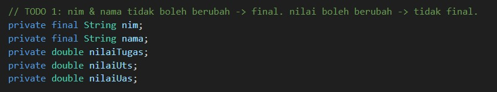

**Penjelasan Kode TODO1:**
> [nim dan nama diatur sebagai final karena invariant pertama menyatakan bahwa NIM tidak boleh diubah. Nilai tidak bersifat final karena masih bisa diupdate. Tidak terdapat setter untuk nilai, sehingga tidak memungkinkan untuk mengubahnya dari luar kelas.]

**Bukti Eksekusi TODO2 (Screenshot):**
* **Before** *(Kondisi awal / Kesalahan kompilasi)*:
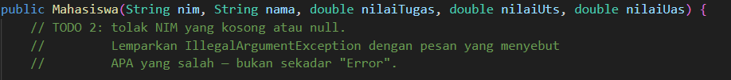

* **After** *(Kondisi akhir / Eksekusi berhasil)*:
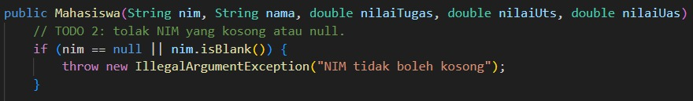

**Penjelasan Kode TODO2:**
> [Pemeriksaan null harus dilakukan terlebih dahulu. Apabila tidak, nim.isBlank() dapat menyebabkan munculnya NullPointerException. isBlank()  juga tidak menerima string yang hanya terdiri dari spasi.]

**Bukti Eksekusi TODO3 (Screenshot):**
* **Before** *(Kondisi awal / Kesalahan kompilasi)*:
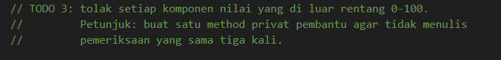

* **After** *(Kondisi akhir / Eksekusi berhasil)*:
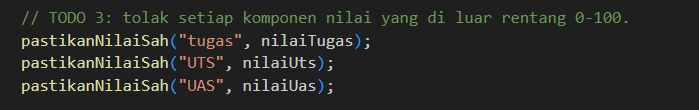

**Penjelasan Kode TODO3:**
> [Validasi dilakukan sebelum pengisian field, sehingga objek yang tidak valid tidak pernah dapat terbentuk. Ketiga elemen menggunakan satu metode pendukung untuk mencegah pemeriksaan yang berulang.]

**Bukti Eksekusi TODO4 (Screenshot):**
* **Before** *(Kondisi awal / Kesalahan kompilasi)*:
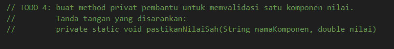

* **After** *(Kondisi akhir / Eksekusi berhasil)*:
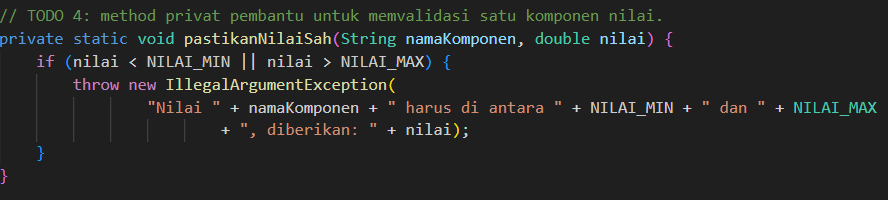

**Penjelasan Kode TODO4:**
> [Metode ini bersifat statis karena tidak memeriksa status objek. Pesan kesalahan menunjukkan komponen yang tidak tepat dan nilai yang dimasukkan. Kode ini mengizinkan NaN, sebab setiap perbandingan dengan NaN menghasilkan nilai false. Solusinya:]

**Bukti Eksekusi TODO5 (Screenshot):**
* **Before** *(Kondisi awal / Kesalahan kompilasi)*:
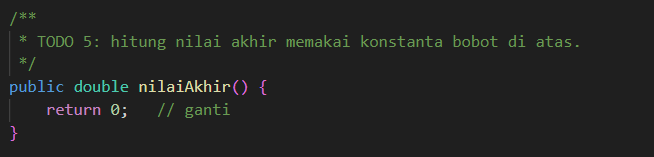

* **After** *(Kondisi akhir / Eksekusi berhasil)*:
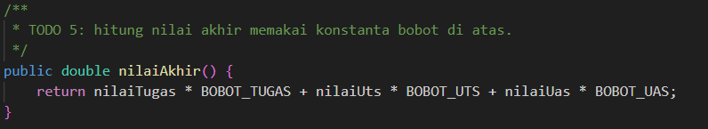

**Penjelasan Kode TODO5:**
> [Rumusnya terdiri dari 30% untuk tugas, 30% untuk UTS, dan 40% untuk UAS. Mengingat penggunaan konstanta, nilai 0.30 dan 0.40 tidak dituliskan secara langsung dalam metode. Apabila persentase mengalami perubahan, hanya perlu melakukan modifikasi di satu bagian saja.]

**Bukti Eksekusi TODO6 (Screenshot):**
* **Before** *(Kondisi awal / Kesalahan kompilasi)*:
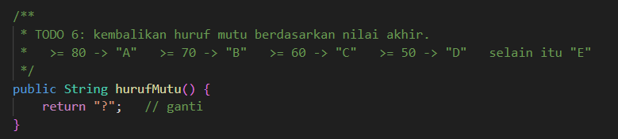

* **After** *(Kondisi akhir / Eksekusi berhasil)*:
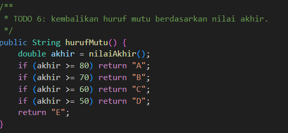

**Penjelasan Kode TODO6:**
> [Pengecekan dimulai dari angka maksimal, sehingga setiap angka hanya bisa memenuhi satu kriteria. Hal yang perlu diperhatikan adalah bahwa tipe data double tidak memiliki tingkat ketelitian yang tinggi. Angka yang seharusnya sama dengan 80 bisa saja terdeteksi sebagai 79.9999999 dan mendapatkan nilai “B”. Sebagai solusinya, angka tersebut dapat dibulatkan terlebih dahulu, contohnya dengan menggunakan Math. round(akhir 100) / 100.0.]

**Bukti Eksekusi TODO7 (Screenshot):**
* **Before** *(Kondisi awal / Kesalahan kompilasi)*:
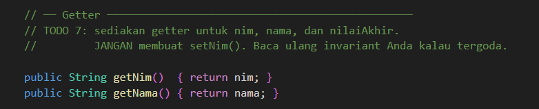

* **After** *(Kondisi akhir / Eksekusi berhasil)*:
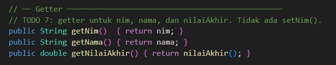

**Penjelasan Kode TODO7:**
> [Tidak terdapat setNim(), sesuai dengan invariannya. Fungsi getNilaiAkhir() tidak menyimpan hasil yang sudah ada, tetapi menghitung kembali berdasarkan nilai dari komponen, sehingga selalu sesuai dengan data yang tersedia.]

### 1.2. File: `Main.java`

* **Tidak ada TODO pada Main.java**

### Output
**Output Program:**
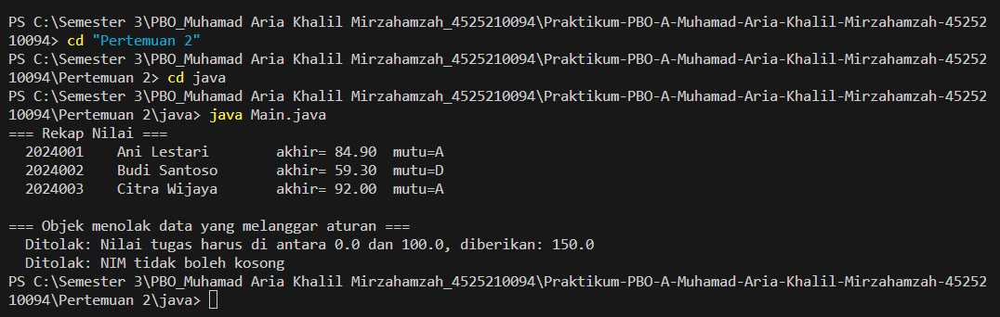

**Penjelasan Kode:**
> [Main. java merupakan program yang digunakan untuk menguji apakah kelas Mahasiswa beroperasi sesuai dengan ketentuan yang ada. Pada bagian pertama, program ini membuat tiga objek mahasiswa dan mencetak informasinya, guna menguji proses perhitungan nilai akhir dan huruf mutu. Selanjutnya, bagian kedua melakukan percobaan dengan memasukkan data yang tidak valid, berupa nilai 150 serta NIM yang kosong, dan kemudian memeriksa apakah keduanya ditolak dengan IllegalArgumentException. Hasil keluaran dibaca secara manual: kata “Ditolak” menunjukkan bahwa validasi berjalan dengan baik, sementara “MASALAH” menandakan adanya kesalahan.]
---

## 2. Implementasi PHP

### 2.1. File: `Mahasiswa.php`

**Bukti Eksekusi TODO1 (Screenshot):**
* **Before** *(Kondisi awal / Galat logika)*:
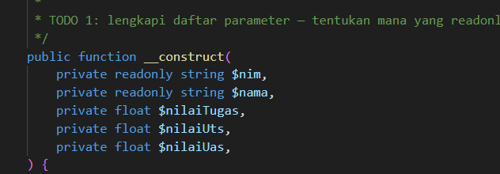

* **After** *(Kondisi akhir / Eksekusi berhasil)*:
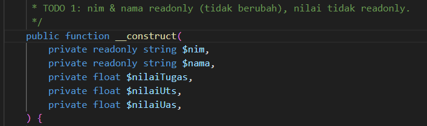

**Penjelasan Kode TODO1:**
> [readonly merupakan padanan akhir dalam Java. nim dan nama tidak dapat dimodifikasi setelah penetapan, sementara nilai dibiarkan tanpa readonly. Di PHP 8, promosi properti konstruktor juga secara bersamaan membuat atribut, sehingga tidak perlu ada deklarasi dan penugasan yang terpisah.]

**Bukti Eksekusi TODO2 (Screenshot):**
* **Before** *(Kondisi awal / Galat logika)*:
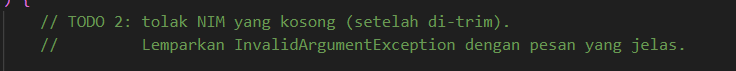

* **After** *(Kondisi akhir / Eksekusi berhasil)*:
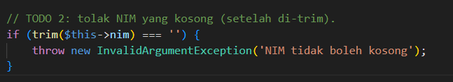

**Penjelasan Kode TODO2:**
> [trim() menghilangkan ruang kosong di bagian depan dan belakang, sehingga NIM yang hanya terdiri dari spasi juga tidak diterima.]

**Bukti Eksekusi TODO3 (Screenshot):**
* **Before** *(Kondisi awal / Galat logika)*:
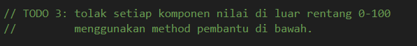

* **After** *(Kondisi akhir / Eksekusi berhasil)*:
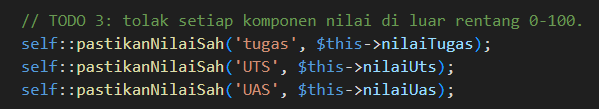

**Penjelasan Kode TODO3:**
> [Pemanggilan terjadi di dalam konstruktor, sebelum objek diakui sebagai yang selesai. Fungsi dipanggil menggunakan self:: karena fungsi tersebut bersifat statis.]

**Bukti Eksekusi TODO4 (Screenshot):**
* **Before** *(Kondisi awal / Galat logika)*:
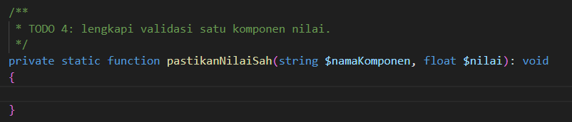

* **After** *(Kondisi akhir / Eksekusi berhasil)*:
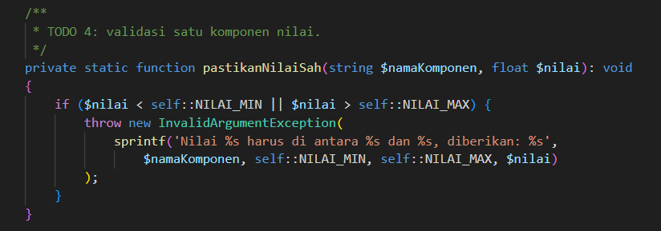

**Penjelasan Kode TODO4:**
> [Pemeriksaan ini memiliki kekurangan serupa: NAN tidak terdeteksi karena setiap perbandingan yang melibatkan NAN menghasilkan nilai false.]

**Bukti Eksekusi TODO5 (Screenshot):**
* **Before** *(Kondisi awal / Galat logika)*:
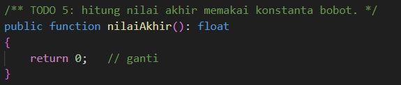

* **After** *(Kondisi akhir / Eksekusi berhasil)*:
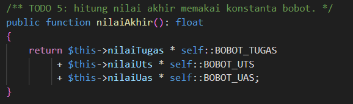

**Penjelasan Kode TODO5:**
> [Bobot diambil dari konstanta yang terdapat dalam kelas (self::), bukan dituliskan langsung sebagai angka. Hasilnya sebanding dengan versi Java.]

**Bukti Eksekusi TODO6 (Screenshot):**
* **Before** *(Kondisi awal / Galat logika)*:
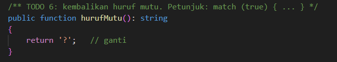

* **After** *(Kondisi akhir / Eksekusi berhasil)*:
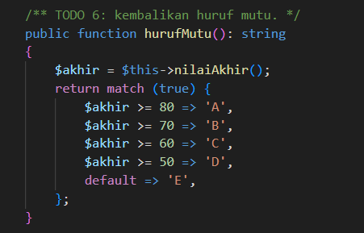

**Penjelasan Kode TODO6:**
> [match (true) menilai keadaan dari atas ke bawah dan mengembalikan nilai pertama yang sesuai. Apabila tidak ada yang sesuai, nilai default akan digunakan. Struktur ini berfungsi sebagai alternatif dari if berurutan dalam Java.]

**Bukti Eksekusi TODO7 (Screenshot):**
* **Before** *(Kondisi awal / Galat logika)*:
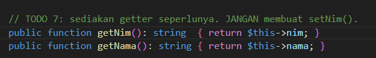

* **After** *(Kondisi akhir / Eksekusi berhasil)*:
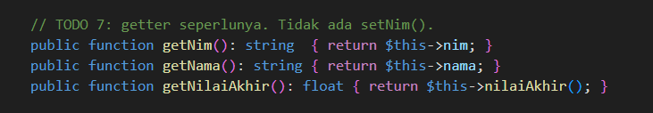

**Penjelasan Kode TODO7:**
> [Tidak terdapat metode setter untuk nim, sesuai dengan invariant yang ada. Fungsi getNilaiAkhir() ditambahkan berdasarkan persyaratan Java agar kedua versi tetap saling sesuai.]

### 2.2. File: `Main.php`

* **Tidak ada TODO pada Main.php**

### Output
**Output Program:**
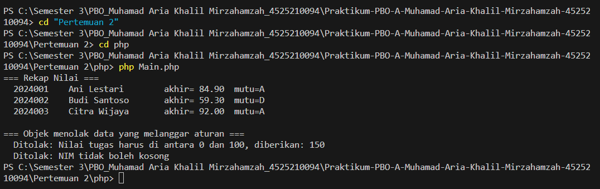

**Penjelasan Kode:**
> [Aplikasi ini menghasilkan tiga objek mahasiswa lalu menampilkannya, dengan tujuan untuk menguji perhitungan akhir dan nilai huruf. Setelah itu, aplikasi berupaya untuk menciptakan seorang mahasiswa dengan nilai 150 serta NIM yang tidak terisi. Apabila Mahasiswa menolak kedua parameter tersebut dengan mempertahankan InvalidArgumentException, maka akan muncul tulisan “Ditolak”. Jika tidak, maka akan terlihat tulisan “MASALAH”.]
---

## 3. Kesimpulan
> [Materi ini membahas tentang cara enkapsulasi pada kelas Mahasiswa menggunakan Java dan PHP, dengan tiga prinsip yang harus dijunjung tinggi: NIM seharusnya tidak boleh kosong dan tidak boleh diubah, tiap nilai (tugas, UTS, UAS) harus berada di rentang 0 sampai 100, dan nilai akhir harus dihitung dengan bobot 30% untuk tugas, 30% untuk UTS, dan 40% untuk UAS. Proses validasi dilakukan di dalam konstruktor sehingga objek yang tidak memenuhi syarat tidak akan dibuat, serta atribut yang tidak boleh diubah ditandai dengan kata kunci final (Java) atau readonly (PHP), dan tidak disediakan setter untuk NIM. Tujuh TODO saling berhubungan untuk menerapkan aturan tersebut, dimulai dari deklarasi atribut, validasi NIM dan rentang nilai, membuat method pembantu, menghitung nilai akhir, menentukan huruf mutu, hingga pembuatan getter. Program tes bernama Main. java dan Main. php memverifikasi hasil dengan mencetak tiga data mahasiswa untuk memastikan bahwa perhitungan dan huruf mutu adalah akurat (Ani A, Budi D, Citra A), kemudian mencoba untuk membuat data yang salah, yaitu nilai 150 dan NIM yang tidak ada. Jika keduanya ditolak, hasilnya akan menunjukkan “Ditolak”, dan jika ada yang diterima, hasilnya akan mencatat “MASALAH”. Perbaikan yang direkomendasikan mencakup validasi NaN dengan kondisi ! (nilai >= MIN && nilai]
