# LAPORAN PRAKTIKUM PEMROGRAMAN BERBASIS OBJEK

| Informasi Praktikan | Keterangan |
| :--- | :--- |
| **Nama** | Muhamad Aria Khalil Mirzahamzah |
| **NPM** | 4525210094 |
| **Kelas** | A |
| **Mata Kuliah** | Pemrograman Berbasis Objek (PBO) |
| **Pertemuan** | 3 - Constructor, Anggota Statis, dan Konstanta |
| **Tanggal** | 17/09/2026 |

---

## 1. Implementasi Java

### 1.1. File: `RekeningBank.java`

**TODO 1: Konstanta**

* **Before** *(Kondisi awal / Kesalahan kompilasi)*:
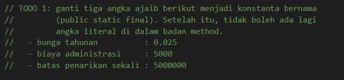

* **After** *(Kondisi akhir / Eksekusi berhasil)*:
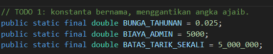

**Penjelasan:**
> Tiga angka langsung di kode diganti dengan konstanta yang diberi nama, yaitu `BUNGA_TAHUNAN`, `BIAYA_ADMIN`, dan `BATAS_TARIK_SEKALI`. Dengan kombinasi `static` dan `final`, nilai tersebut menjadi milik kelas dan tidak dapat diubah. Bila aturan bank berubah, cukup satu baris yang diedit.

**TODO 2: Field Statis Penghitung**

* **Before** *(Kondisi awal / Kesalahan kompilasi)*:
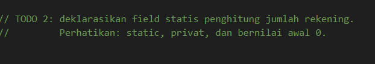

* **After** *(Kondisi akhir / Eksekusi berhasil)*:
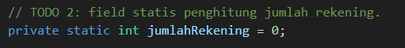

**Penjelasan:**
> Field `jumlahRekening` dibuat `static` karena nilainya dimiliki bersama oleh seluruh kelas, bukan oleh satu objek saja. Modifier `private` membuat kode di luar kelas tidak bisa mengubahnya secara langsung.

**TODO 3: Delegasi Constructor dengan `this(...)`**

* **Before** *(Kondisi awal / Kesalahan kompilasi)*:
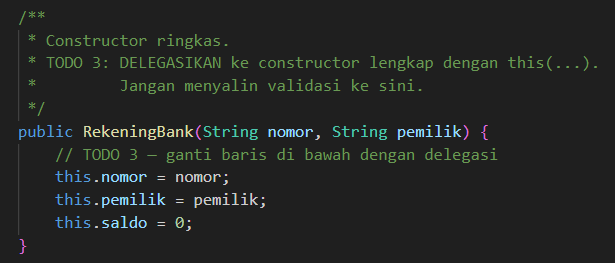

* **After** *(Kondisi akhir / Eksekusi berhasil)*:
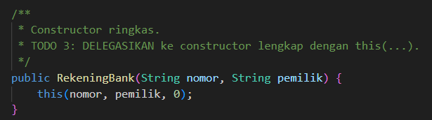

**Penjelasan:**
> Constructor ringkas `RekeningBank(nomor, pemilik)` meneruskan tugasnya ke `this(nomor, pemilik, 0)`. Dengan begitu, validasi cukup ditulis sekali di constructor lengkap dan tidak perlu diulang.

**TODO 4: Validasi di Constructor Lengkap**

* **Before** *(Kondisi awal / Kesalahan kompilasi)*:
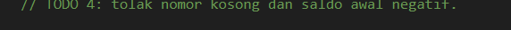

* **After** *(Kondisi akhir / Eksekusi berhasil)*:
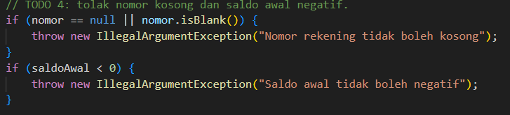

**Penjelasan:**
> Nomor yang kosong dan saldo awal yang negatif langsung ditolak dengan `IllegalArgumentException`, sebelum field diisi. Akibatnya, objek yang tidak valid tidak pernah berhasil dibuat.

**TODO 5: Menaikkan Penghitung**

* **Before** *(Kondisi awal / Kesalahan kompilasi)*:
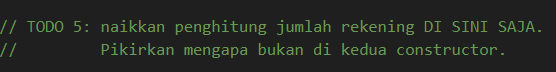

* **After** *(Kondisi akhir / Eksekusi berhasil)*:
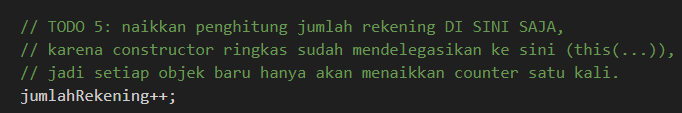

**Penjelasan:**
> Baris `jumlahRekening++` hanya ditulis di constructor lengkap. Karena constructor ringkas selalu lewat ke constructor lengkap, setiap objek baru hanya dihitung satu kali. Bila baris ini juga ditulis di constructor ringkas, objek akan terhitung dua kali.

**TODO 6: Setor**

* **Before** *(Kondisi awal / Kesalahan kompilasi)*:
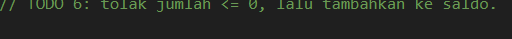

* **After** *(Kondisi akhir / Eksekusi berhasil)*:
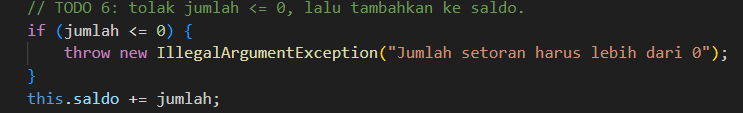

**Penjelasan:**
> Jumlah setoran wajib lebih dari 0. Setoran yang lolos pemeriksaan kemudian ditambahkan ke saldo.

**TODO 7: Tarik**

* **Before** *(Kondisi awal / Kesalahan kompilasi)*:
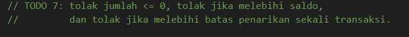

* **After** *(Kondisi akhir / Eksekusi berhasil)*:
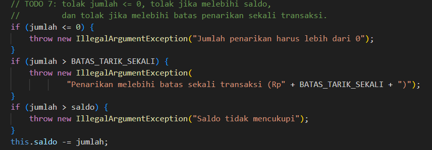

**Penjelasan:**
> Penarikan diperiksa secara berurutan: jumlahnya harus lebih dari 0, tidak boleh melewati batas sekali transaksi, dan tidak boleh melebihi saldo. Dengan urutan ini, pesan error yang muncul menunjukkan penyebab yang sebenarnya.

**TODO 8: Potong Biaya Admin**

* **Before** *(Kondisi awal / Kesalahan kompilasi)*:
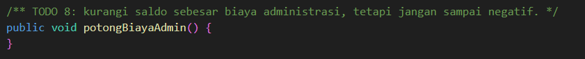

* **After** *(Kondisi akhir / Eksekusi berhasil)*:

**Penjelasan:**
> Pemanggilan `Math.max(0, saldo - BIAYA_ADMIN)` menjamin saldo tidak pernah minus. Jika saldo lebih kecil dari biaya admin, saldo akan menjadi 0.

**TODO 9: Getter Statis Jumlah Rekening**

* **Before** *(Kondisi awal / Kesalahan kompilasi)*:
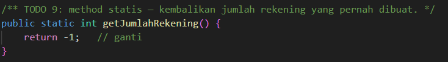

* **After** *(Kondisi akhir / Eksekusi berhasil)*:
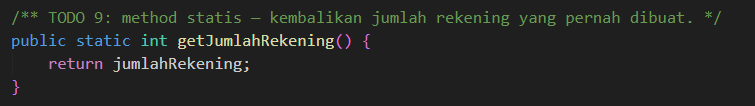

**Penjelasan:**
> Method ini bersifat `static` karena tidak membutuhkan data dari objek tertentu. Pemanggilannya cukup dengan `RekeningBank.getJumlahRekening()`.

**TODO 10: Bunga Setahun**

* **Before** *(Kondisi awal / Kesalahan kompilasi)*:
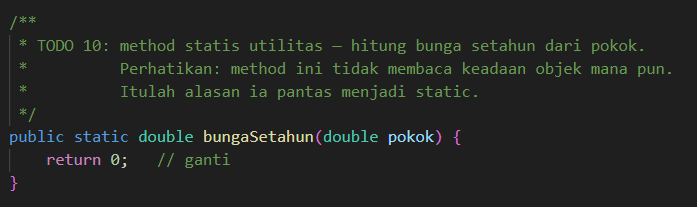

* **After** *(Kondisi akhir / Eksekusi berhasil)*:
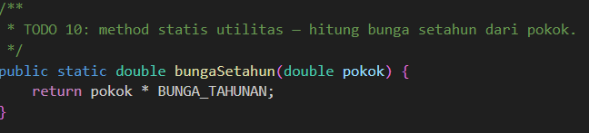

**Penjelasan:**
> Method ini bersifat `static` karena hasilnya hanya bergantung pada parameter `pokok` dan konstanta, tanpa membaca saldo milik objek mana pun.

### 1.2. File: `Main.java`

* Tidak ada TODO pada `Main.java`.

**Code Program:**
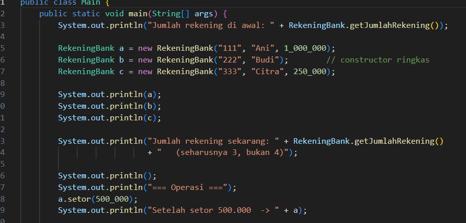

.png)

**Output Program:**
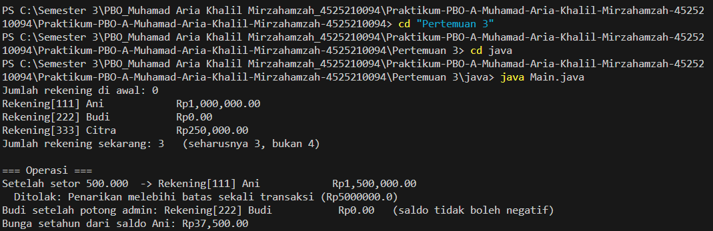

**Penjelasan:**
> `Main.java` membuat tiga rekening, lalu menguji setoran, penarikan yang melebihi batas, pemotongan biaya admin, dan perhitungan bunga. Hasil yang diharapkan: jumlah rekening 3, saldo Ani menjadi Rp1.500.000 setelah setor, penarikan Rp9.999.999 ditolak, saldo Budi tetap 0 setelah potong admin, dan bunga Ani Rp37.500,00.

---

## 2. Implementasi PHP

### 2.1. File: `RekeningBank.php`

**TODO 1: Konstanta**

* **Before** *(Kondisi awal / Galat logika)*:
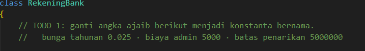

* **After** *(Kondisi akhir / Eksekusi berhasil)*:
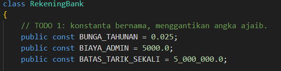

**Penjelasan:**
> Angka langsung diganti dengan konstanta kelas (`const`) yang diakses melalui `self::`. Setelah didefinisikan, nilainya tidak bisa diubah.

**TODO 2: Properti Statis Penghitung**

* **Before** *(Kondisi awal / Galat logika)*:
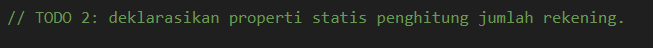

* **After** *(Kondisi akhir / Eksekusi berhasil)*:
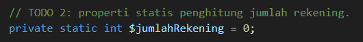

**Penjelasan:**
> `private static int $jumlahRekening` menyimpan jumlah rekening untuk seluruh kelas, bukan untuk satu objek.

**TODO 3 dan 4: Constructor dengan Default Parameter**

* **Before** *(Kondisi awal / Galat logika)*:
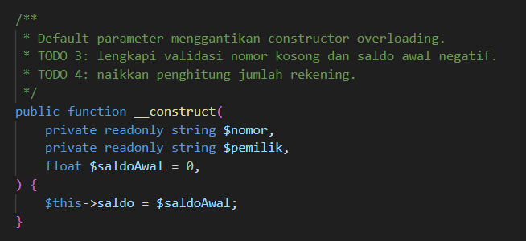

* **After** *(Kondisi akhir / Eksekusi berhasil)*:
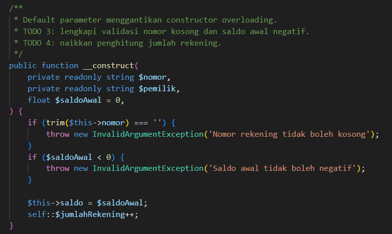

**Penjelasan:**
> PHP tidak mendukung constructor overloading, jadi cukup dibuat satu constructor dengan default parameter `float $saldoAwal = 0`. Validasi nomor kosong dan saldo negatif dilakukan di sini, lalu penghitung dinaikkan dengan `self::$jumlahRekening++` sekali untuk setiap objek.

**TODO 5: Named Constructor**

* **Before** *(Kondisi awal / Galat logika)*:
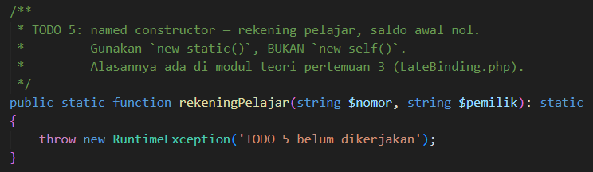

* **After** *(Kondisi akhir / Eksekusi berhasil)*:
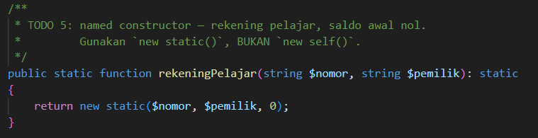

**Penjelasan:**
> `rekeningPelajar()` berfungsi sebagai pengganti constructor overloading di PHP. Kata kunci `new static()` dipakai, bukan `new self()`, supaya objek yang dibuat mengikuti kelas yang memanggil method tersebut. Jika ada subclass, objek yang dihasilkan tetap bertipe subclass itu.

**TODO 6: Setor**

* **Before** *(Kondisi awal / Galat logika)*:
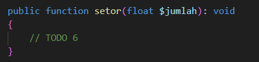

* **After** *(Kondisi akhir / Eksekusi berhasil)*:
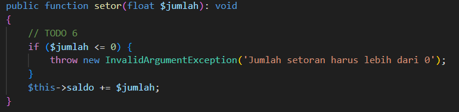

**Penjelasan:**
> Setoran harus lebih dari 0, lalu ditambahkan ke saldo. Alurnya sama dengan versi Java.

**TODO 7: Tarik**

* **Before** *(Kondisi awal / Galat logika)*:
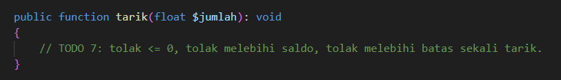

* **After** *(Kondisi akhir / Eksekusi berhasil)*:
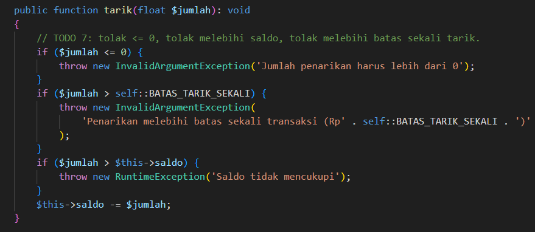

**Penjelasan:**
> Pemeriksaannya sama seperti versi Java: jumlah harus positif, tidak boleh melewati batas sekali transaksi, dan tidak boleh melebihi saldo.

**TODO 8: Potong Biaya Admin**

* **Before** *(Kondisi awal / Galat logika)*:
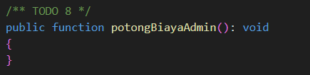

* **After** *(Kondisi akhir / Eksekusi berhasil)*:
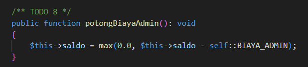

**Penjelasan:**
> Pemanggilan `max(0.0, $this->saldo - self::BIAYA_ADMIN)` memastikan saldo tidak akan pernah negatif.

**TODO 9: Getter Statis Jumlah Rekening**

* **Before** *(Kondisi awal / Galat logika)*:
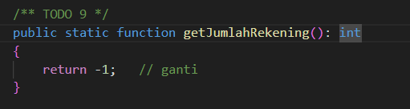

* **After** *(Kondisi akhir / Eksekusi berhasil)*:
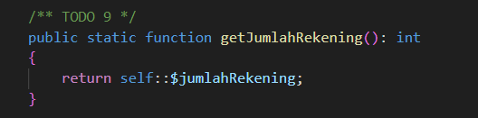

**Penjelasan:**
> Method statis ini mengembalikan nilai `self::$jumlahRekening` dan dipanggil dengan `RekeningBank::getJumlahRekening()`.

**TODO 10: Bunga Setahun**

* **Before** *(Kondisi awal / Galat logika)*:
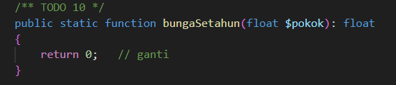

* **After** *(Kondisi akhir / Eksekusi berhasil)*:
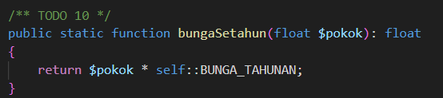

**Penjelasan:**
> Method statis ini menghitung `$pokok * self::BUNGA_TAHUNAN` tanpa membaca data objek mana pun.

### 2.2. File: `main.php`

* Tidak ada TODO pada `main.php`.

**Code Program:**
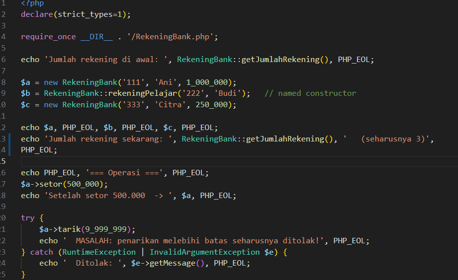

.png)

**Output Program:**
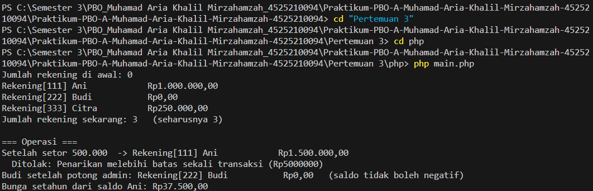

**Penjelasan:**
> Program ini menguji hal yang sama dengan versi Java. Hasil yang diharapkan juga sama: jumlah rekening 3, penarikan yang melebihi batas ditolak, saldo Budi tetap 0, dan bunga Ani Rp37.500,00.

---

## 3. Kesimpulan

> Pertemuan 3 membahas constructor berdelegasi, anggota statis, dan konstanta melalui kelas `RekeningBank` di Java dan PHP. Kelas ini menjaga tiga aturan: saldo tidak pernah negatif, nomor rekening tidak berubah setelah dibuat, dan setoran serta penarikan selalu bernilai positif.
>
> Java mengatasi kebutuhan beberapa constructor dengan `this(...)`, sehingga validasi hanya perlu ditulis sekali. PHP tidak mengenal constructor overloading, sehingga digunakan default parameter dan named constructor dengan `new static()`. Penghitung jumlah rekening disimpan sebagai anggota statis dan dinaikkan sekali untuk setiap objek. Method `bungaSetahun()` dibuat statis karena tidak membaca keadaan objek mana pun.
>
> Program uji `Main.java` dan `main.php` memeriksa hasilnya dengan membuat tiga rekening, menyetor, menguji penarikan yang melebihi batas, memotong biaya admin, dan menghitung bunga. Hasil yang diharapkan adalah jumlah rekening 3, saldo Ani Rp1.500.000, penarikan Rp9.999.999 ditolak, saldo Budi tetap 0, dan bunga Ani Rp37.500,00.
>
> Perbaikan yang disarankan meliputi validasi `NaN` dengan kondisi `!(jumlah > 0)` pada `setor` dan `tarik`, penyeragaman jenis exception di PHP menjadi `InvalidArgumentException`, dan penghapusan tipe pada konstanta PHP jika menggunakan versi di bawah 8.3.

