# LAPORAN PRAKTIKUM PEMROGRAMAN BERBASIS OBJEK

| Informasi Praktikan | Keterangan |
| :--- | :--- |
| **Nama** | Muhamad Aria Khalil Mirzahamzah |
| **NPM** | 4525210094 |
| **Kelas** | A |
| **Mata Kuliah** | Pemrograman Berbasis Objek (PBO) |
| **Pertemuan** | 4 - Pewarisan (Inheritance) dan Polimorfisme |
| **Tanggal** | 24/09/2026 |

---

## 1. Implementasi Java

### 1.1. Langkah 1: Percobaan Kelas Abstrak

**Before** *(Kelas abstrak di-instansiasi langsung)*:
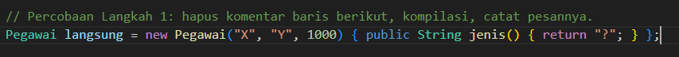

**After** *(Kelas abstrak di-instansiasi langsung)*:
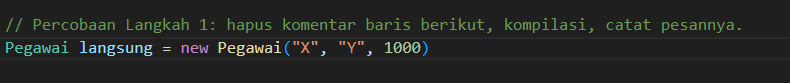

**Running** *(Kelas abstrak di-instansiasi langsung)*:
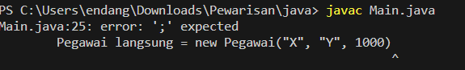

**Penjelasan:**
> Baris percobaan di `Main.java` tetap bisa dikompilasi karena memakai badan anonim `{ public String jenis() {...} }`. Badan tersebut membentuk subkelas anonim yang sudah menyediakan method `jenis()`, sehingga Java tidak mengeluhkan kelas abstraknya. Untuk memunculkan error `Pegawai is abstract; cannot be instantiated`, badan anonim perlu dihapus sehingga baris menjadi `new Pegawai("X", "Y", 1000);`. Pesan itu menegaskan bahwa kelas abstrak tidak dapat dibuat objeknya secara langsung.

### 1.2. File: `Pegawai.java`

**TODO 1: Validasi Gaji Pokok**

* **Before** *(Kondisi awal / Kesalahan kompilasi)*:
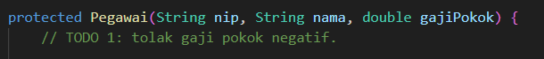

* **After** *(Kondisi akhir / Eksekusi berhasil)*:
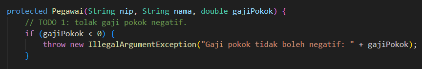

**Penjelasan:**
> Constructor induk menolak gaji pokok negatif dengan `IllegalArgumentException`. Pemeriksaan ini hanya ditulis sekali di kelas induk, sehingga seluruh turunannya ikut terlindungi.

**TODO 2: Perilaku Dasar `hitungGaji()`**

* **Before** *(Kondisi awal / Kesalahan kompilasi)*:
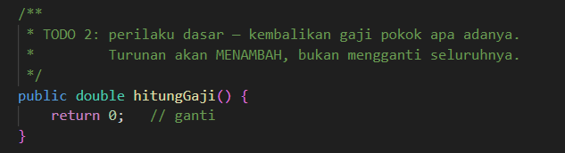

* **After** *(Kondisi akhir / Eksekusi berhasil)*:
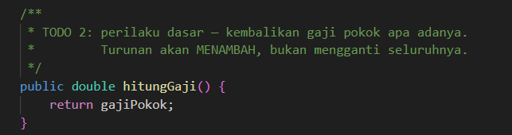

**Penjelasan:**
> Method `hitungGaji()` di kelas induk hanya mengembalikan gaji pokok. Turunan tidak menggantinya sepenuhnya, melainkan menambahkan komponen miliknya sendiri lewat `super.hitungGaji()`.

**Kode Lengkap:**
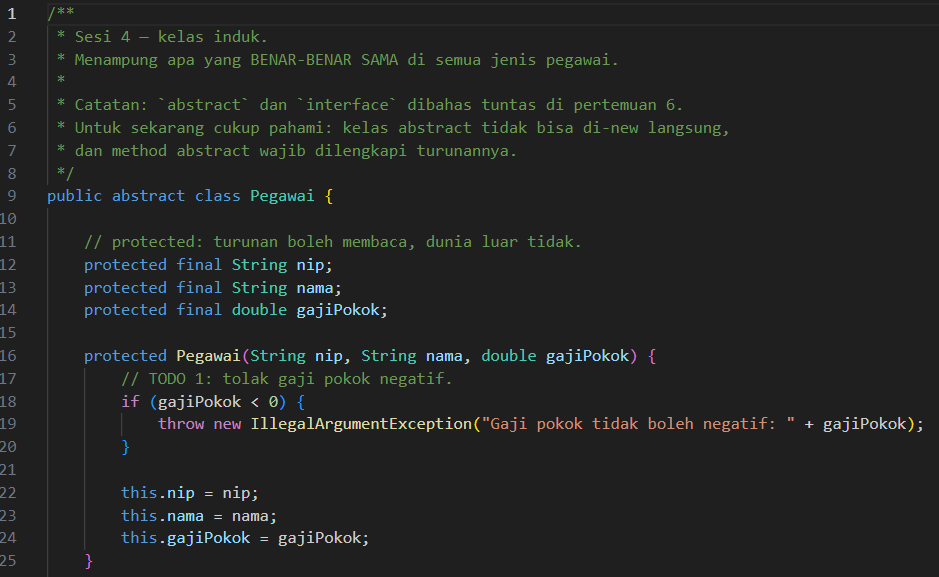
.png)

### 1.3. File: `PegawaiTetap.java`

**Langkah 3: Menghapus `super(...)`**

**Before*** (Constructor tanpa pemanggilan induk)*:
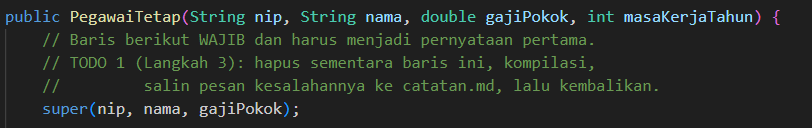

**After** (Constructor tanpa pemanggilan induk)*:
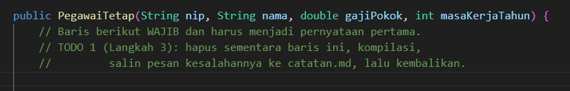

**Running** (Constructor tanpa pemanggilan induk)*:
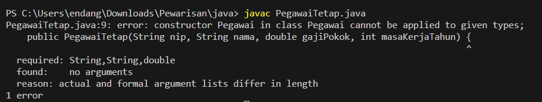

**Penjelasan:**
> Ketika `super(nip, nama, gajiPokok);` dihapus, Java menyisipkan `super()` secara otomatis. Karena kelas `Pegawai` tidak punya constructor tanpa parameter, kompilasi gagal dengan pesan `constructor Pegawai in class Pegawai cannot be applied to given types`. Dari sini terlihat bahwa constructor induk wajib dipanggil dan harus berada di baris pertama.

**TODO 2: Hitung Gaji dengan Tunjangan Masa Kerja**

* **Before** *(Kondisi awal / Kesalahan kompilasi)*:
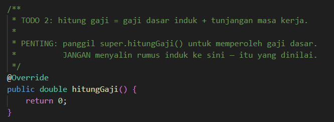

* **After** *(Kondisi akhir / Eksekusi berhasil)*:
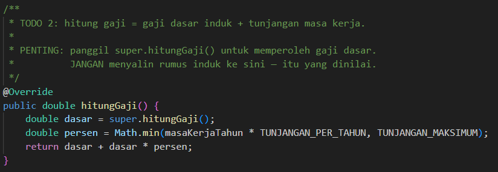

**Penjelasan:**
> Gaji dasar diambil dari `super.hitungGaji()`, sehingga rumus induk tidak disalin ke kelas ini. Tunjangan dihitung 2% per tahun masa kerja dengan batas maksimum 40%, lalu ditambahkan ke gaji dasar. Contohnya, masa kerja 15 tahun menghasilkan tunjangan 30%.

**Kode Lengkap:**
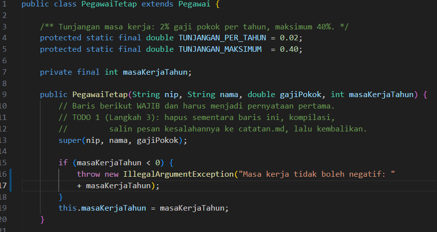
.png)

### 1.4. File: `PegawaiKontrak.java`

**TODO 2: Perlukah `hitungGaji()` Di-override?**

* **Before** *(Kondisi awal / Kesalahan kompilasi)*:
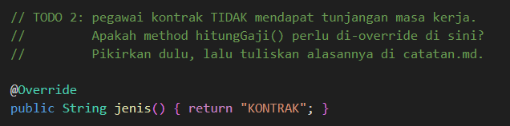

* **After** *(Kondisi akhir / Eksekusi berhasil)*:
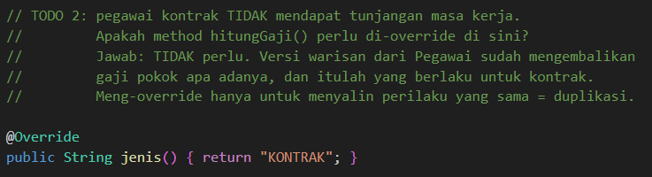

**Penjelasan:**
> Tidak perlu. Pegawai kontrak tidak mendapat tunjangan masa kerja, jadi perilaku warisan dari `Pegawai` sudah sesuai dan mengembalikan gaji pokok apa adanya. Meng-override method hanya untuk mengulang perilaku yang sama akan membuat kode terduplikasi.

**Kode Lengkap:**
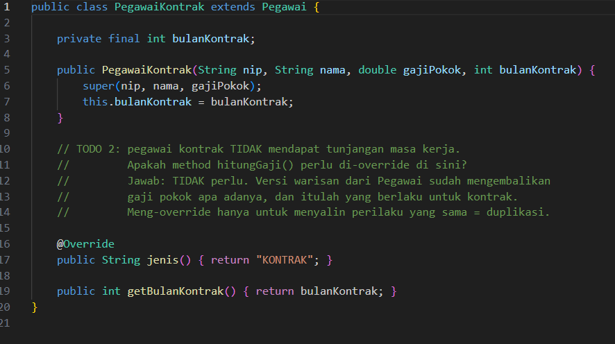

### 1.5. Langkah 4: Penambahan Kelas `Dosen` dan `PegawaiHarian`

Kedua kelas ini dibuat tanpa TODO. `Dosen` mewarisi `PegawaiTetap` dan menambahkan tunjangan fungsional berupa nominal tetap. `PegawaiHarian` mewarisi `Pegawai` dan memperlakukan gaji pokok sebagai upah per hari, yang kemudian dikalikan jumlah hari kerja.

**Kode `Dosen.java`:**
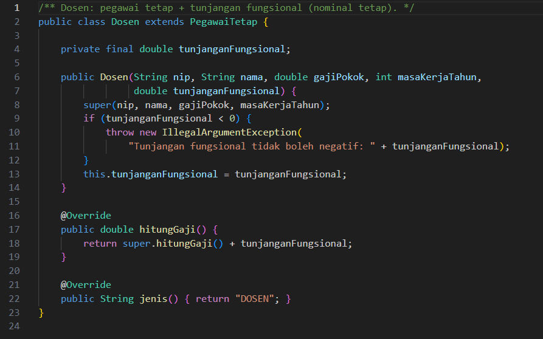

**Kode `PegawaiHarian.java`:**
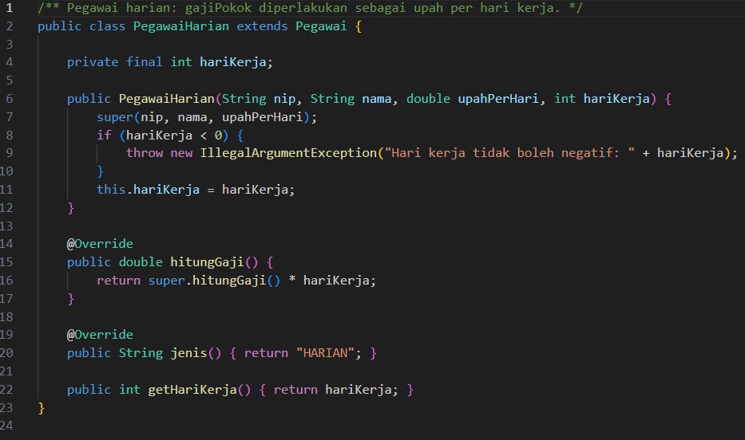

**Penjelasan:**
> `Dosen` memanggil `super.hitungGaji()` milik `PegawaiTetap` sehingga tunjangan masa kerja ikut terhitung, lalu menambahkan tunjangan fungsionalnya. `PegawaiHarian` mengalikan upah harian dengan jumlah hari kerja. Kedua kelas cukup menulis bagian yang membedakannya dari induk.

### 1.6. File: `Main.java`

* Tidak ada TODO pada `Main.java`.

**Kode Program:**
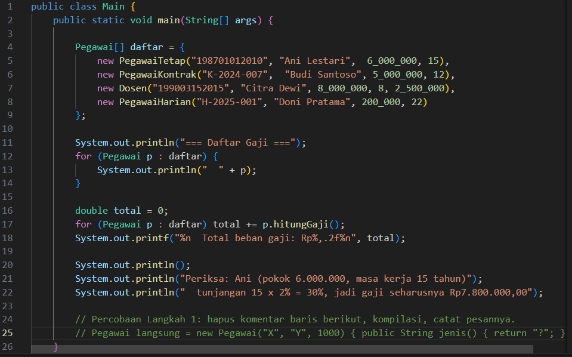

**Output Program:**

**Penjelasan:**
> `Main.java` menyimpan keempat jenis pegawai dalam satu array bertipe `Pegawai`, lalu memanggil `hitungGaji()` pada setiap elemen. Setiap objek menjalankan versinya sendiri, dan inilah contoh polimorfisme. Hasil yang diharapkan:

| Pegawai | Jenis | Gaji |
| :--- | :--- | :--- |
| Ani Lestari | TETAP | Rp7.800.000,00 |
| Budi Santoso | KONTRAK | Rp5.000.000,00 |
| Citra Dewi | DOSEN | Rp11.780.000,00 |
| Doni Pratama | HARIAN | Rp4.400.000,00 |
| **Total** | | **Rp28.980.000,00** |

---

## 2. Implementasi PHP

Seluruh hierarki PHP ditulis dalam satu berkas `Pegawai.php`, sehingga screenshot kode dan TODO-nya berada di satu tempat.

### 2.1. Langkah 3: Menghapus `parent::__construct(...)`

**Before** *(Constructor tanpa pemanggilan induk)*:
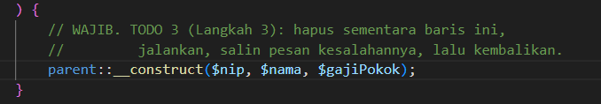

**After** *(Constructor tanpa pemanggilan induk)*:
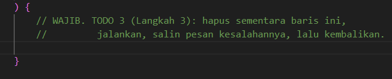

**Running** *(Constructor tanpa pemanggilan induk)*:
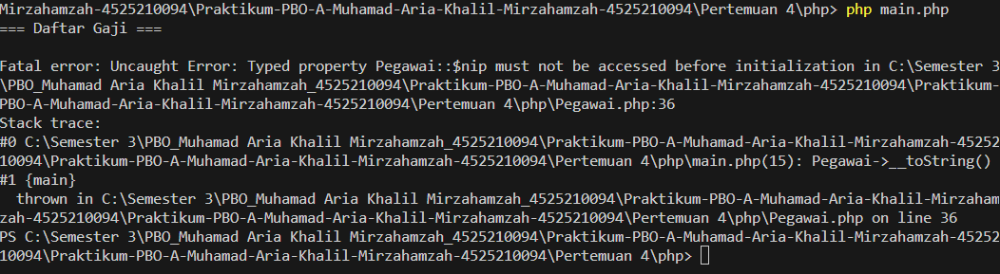

**Penjelasan:**
> Berbeda dengan Java, PHP tidak otomatis memanggil constructor induk. Setelah baris `parent::__construct(...)` dihapus, skrip masih bisa dijalankan. Error baru muncul saat properti `nip`, `nama`, atau `gajiPokok` diakses, yaitu `must not be accessed before initialization`, karena properti bertipe tersebut belum pernah diinisialisasi.

### 2.2. File: `Pegawai.php`

**TODO 1: Validasi Gaji Pokok**

* **Before** *(Kondisi awal / Galat logika)*:
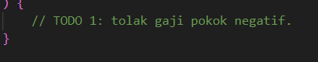

* **After** *(Kondisi akhir / Eksekusi berhasil)*:
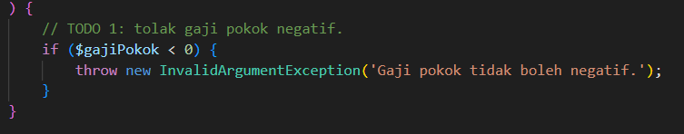

**Penjelasan:**
> Gaji pokok negatif ditolak dengan `InvalidArgumentException` di constructor induk. Karena memakai constructor property promotion, properti `readonly` langsung terbentuk tanpa perlu penugasan terpisah.

**TODO 2: Perilaku Dasar `hitungGaji()`**

* **Before** *(Kondisi awal / Galat logika)*:
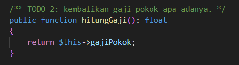

* **After** *(Kondisi akhir / Eksekusi berhasil)*:
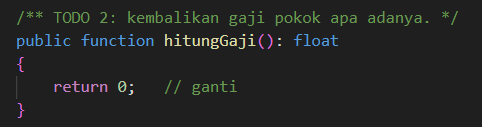

**Penjelasan:**
> Method induk mengembalikan `$this->gajiPokok` apa adanya. Turunan menambahkan komponennya sendiri melalui `parent::hitungGaji()`.

**TODO 3: Langkah 3 pada `PegawaiTetap`**

Langkah ini sudah dijelaskan pada bagian 2.1.

**TODO 4: Hitung Gaji dengan Tunjangan Masa Kerja**

* **Before** *(Kondisi awal / Galat logika)*:
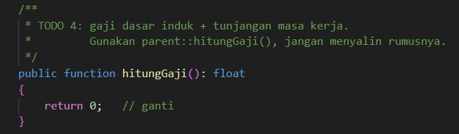

* **After** *(Kondisi akhir / Eksekusi berhasil)*:
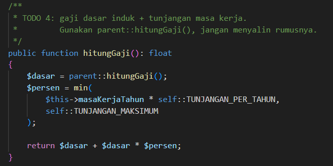

**Penjelasan:**
> Gaji dasar diambil dari `parent::hitungGaji()`. Tunjangan dihitung 2% per tahun dengan batas 40%, dengan nilai yang diambil dari konstanta `self::TUNJANGAN_PER_TAHUN` dan `self::TUNJANGAN_MAKSIMUM`.

**Kode Lengkap:**
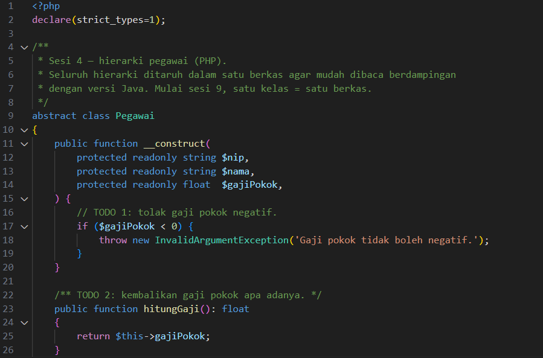
.png)
.png)
.png)
.png)
.png)
.png)
.png)

### 2.3. Langkah 4: Penambahan Kelas `Dosen` dan `PegawaiHarian`

Kedua kelas ditambahkan di bagian bawah `Pegawai.php` dengan pola yang sama seperti versi Java. `Dosen` mewarisi `PegawaiTetap` dan menerima tunjangan fungsional lewat constructor promotion. `PegawaiHarian` mewarisi `Pegawai` dan mengalikan upah per hari dengan jumlah hari kerja.

### 2.4. File: `main.php`

* Tidak ada TODO pada `main.php`.

**Kode Program:**
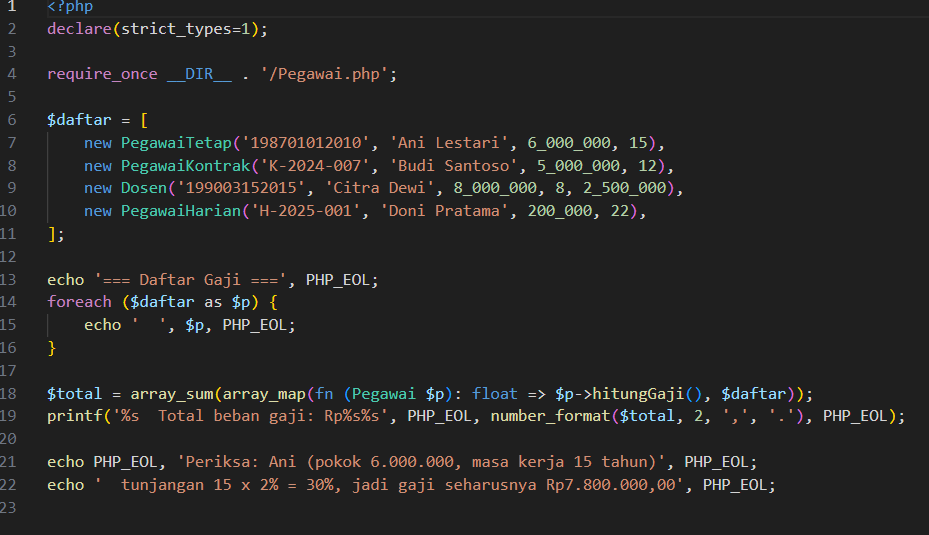

**Output Program:**

**Penjelasan:**
> `main.php` membuat keempat pegawai dalam satu array, lalu mencetak daftar gaji dan total beban gaji. Hasilnya sama dengan versi Java, yaitu total Rp28.980.000,00.

---

## 3. Kesimpulan

> Pertemuan 4 membahas pewarisan dengan kelas induk `Pegawai` dan turunannya, yaitu `PegawaiTetap`, `PegawaiKontrak`, `Dosen`, dan `PegawaiHarian`. Bagian yang sama, seperti gaji pokok, validasi, dan `toString()`, cukup ditulis sekali di induk, sedangkan setiap turunan hanya menulis bagian yang membedakannya.
>
> Turunan wajib memanggil constructor induk lewat `super(...)` di Java atau `parent::__construct(...)` di PHP sebagai pernyataan pertama. Perhitungan gaji memakai `super.hitungGaji()` atau `parent::hitungGaji()` agar rumus induk tidak disalin. Kelas `Pegawai` dibuat `abstract` sehingga objeknya tidak bisa dibuat langsung, dan setiap turunan wajib mengisi method `jenis()`.
>
> `Main.java` dan `main.php` membuat array bertipe `Pegawai` yang berisi keempat jenis pegawai. Setiap elemen menjalankan `hitungGaji()` versinya sendiri, yang merupakan inti dari polimorfisme. Hasil yang diharapkan adalah total beban gaji Rp28.980.000,00.
>
> Perbaikan yang disarankan meliputi validasi masa kerja dan hari kerja negatif pada versi PHP agar setara dengan Java, serta penggunaan `final` atau `readonly` yang konsisten pada atribut yang tidak boleh berubah.
