# LAPORAN PRAKTIKUM PEMROGRAMAN BERBASIS OBJEK

| Informasi Praktikan | Keterangan |
| :--- | :--- |
| **Nama** | Muhamad Aria Khalil Mirzahamzah |
| **NPM** | 4525210094 |
| **Kelas** | A |
| **Mata Kuliah** | Pemrograman Berbasis Objek (PBO) |
| **Pertemuan** | 5 - Polimorfisme (Polymorphism) |
| **Tanggal** | [isi tanggal praktikum] |

---

## 1. Implementasi Java

### 1.1. File: `Persegi.java`

**TODO 1: Validasi Sisi**

* **Before** *(Kondisi awal / Kesalahan kompilasi)*:
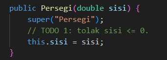

* **After** *(Kondisi akhir / Eksekusi berhasil)*:
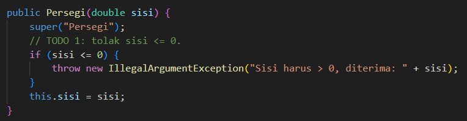

**Penjelasan:**
> Sisi yang bernilai nol atau negatif ditolak dengan `IllegalArgumentException` di constructor, sehingga objek `Persegi` yang tidak valid tidak pernah terbentuk.

**TODO 2: Luas dan Keliling**

* **Before** *(Kondisi awal / Kesalahan logika)*:
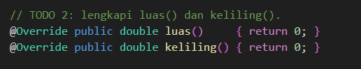

* **After** *(Kondisi akhir / Eksekusi berhasil)*:
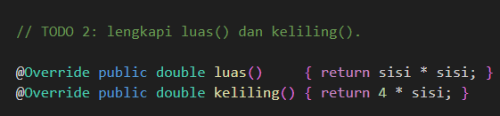

**Penjelasan:**
> Luas dihitung dari `sisi * sisi` dan keliling dari `4 * sisi`. Kedua method ini mengisi kontrak `abstract` milik `BangunDatar`.

**Kode Lengkap:**
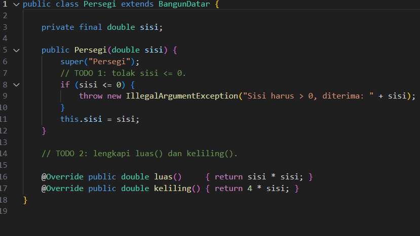

### 1.2. File: `Lingkaran.java`

**TODO 1: Validasi Jari-Jari**

* **Before** *(Kondisi awal / Kesalahan logika)*:
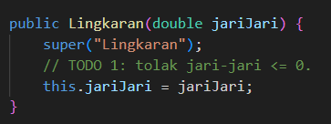

* **After** *(Kondisi akhir / Eksekusi berhasil)*:
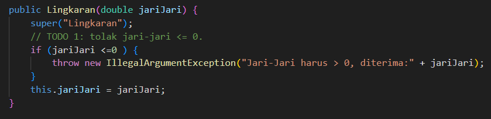

**Penjelasan:**
> Jari-jari yang tidak positif ditolak di constructor dengan pola yang sama seperti `Persegi`.

**TODO 2: Luas dan Keliling**

* **Before** *(Kondisi awal / Kesalahan logika)*:
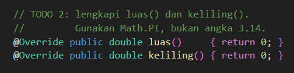

* **After** *(Kondisi akhir / Eksekusi berhasil)*:
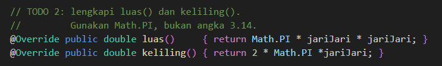

**Penjelasan:**
> Luas dihitung dengan `Math.PI * jariJari * jariJari` dan keliling dengan `2 * Math.PI * jariJari`. Konstanta `Math.PI` dipakai agar hasilnya lebih akurat dibanding angka 3,14.

**Kode Lengkap:**
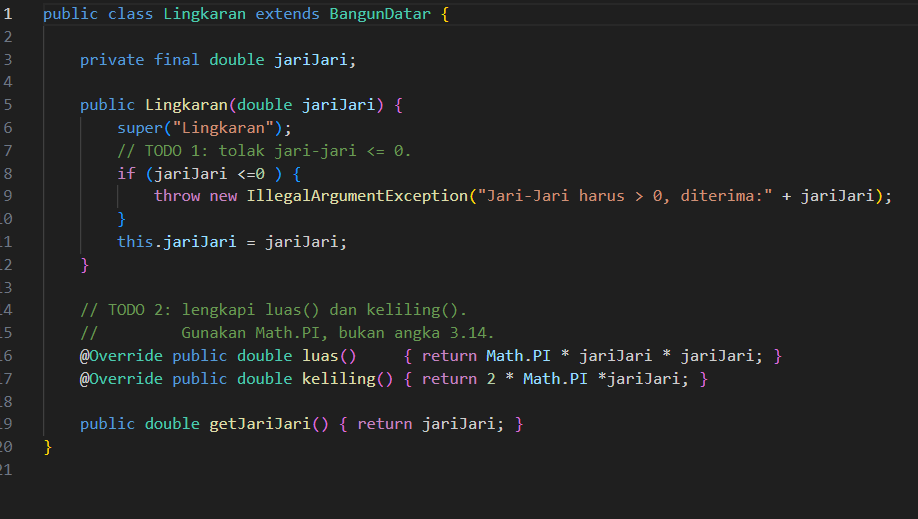

### 1.3. File: `Segitiga.java`

**Kode Lengkap:**
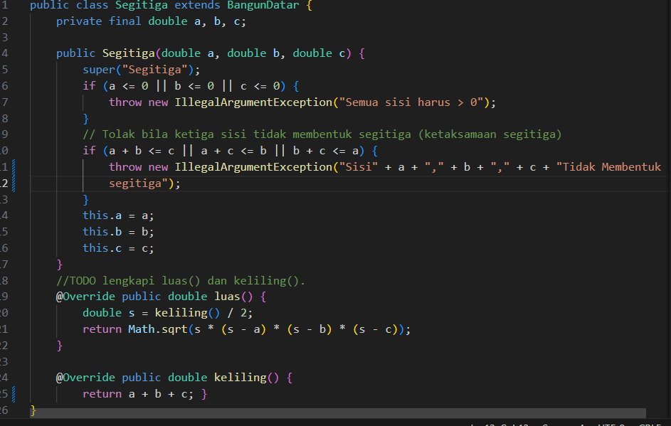

**Penjelasan:**
> Kode Segitiga.java mewarisi BangunDatar dan memvalidasi sisinya di constructor, yaitu harus positif dan memenuhi ketaksamaan segitiga. Ketiga sisi disimpan sebagai final. Method luas() memakai rumus Heron dengan semi-keliling dari keliling(), sedangkan keliling() menjumlahkan a + b + c. Untuk Segitiga(3, 4, 5), keliling 12,00 dan luas 6,00. Komentar //TODO yang tersisa sebaiknya dihapus.

### 1.4. File: `BangunDatar.java`

* Tidak ada TODO yang harus diisi pada `BangunDatar.java`.

**Penjelasan:**
> `toString()` berada di kelas induk, tetapi memanggil `luas()` dan `keliling()` yang implementasinya ada di turunan. Ini mungkin karena Java memilih method berdasarkan tipe objek yang sebenarnya saat runtime, bukan berdasarkan tipe variabelnya. Mekanisme ini disebut dynamic dispatch. Jawaban lengkapnya ditulis di `penelusuran.md`.

**Kode Lengkap:**
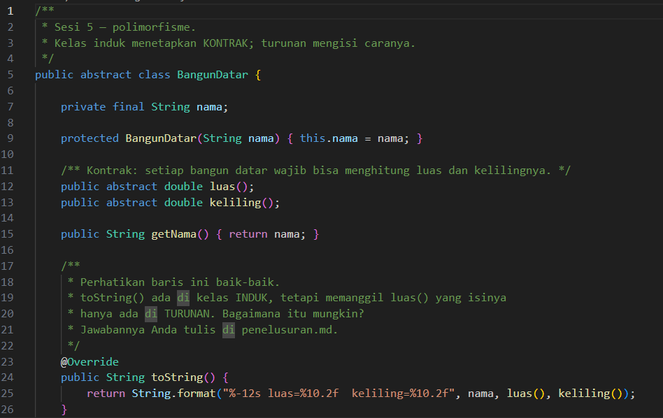

### 1.5. Langkah 4: File `Trapesium.java`

Kelas ini dibuat tanpa TODO. `Trapesium` mewarisi `BangunDatar` dan menerima dua sisi sejajar, tinggi, serta dua kaki. Konstruktor memastikan semua ukuran positif dan kaki tidak lebih pendek dari tinggi.

**Kode Lengkap:**
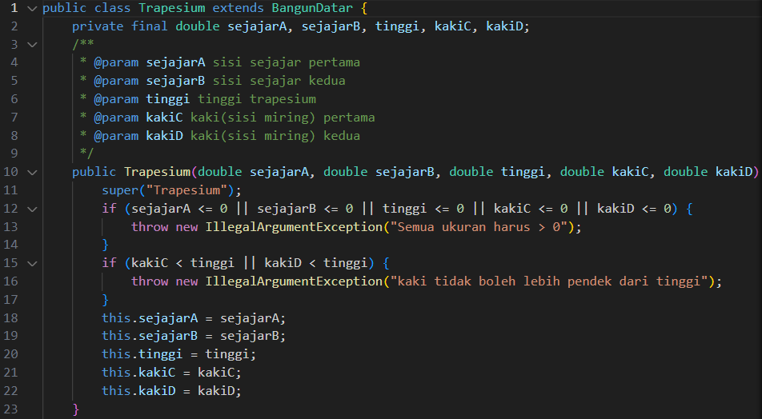
.png)

### 1.6. Langkah 5: Anti-Pattern dan Refaktor Polimorfik

**Before** *(Versi anti-pattern dijalankan apa adanya)*:
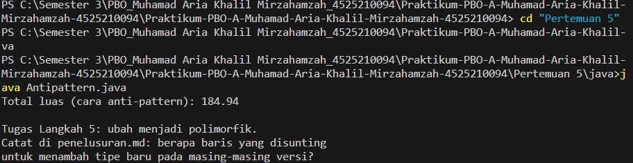

**After** *(Versi refaktor berjalan)*:
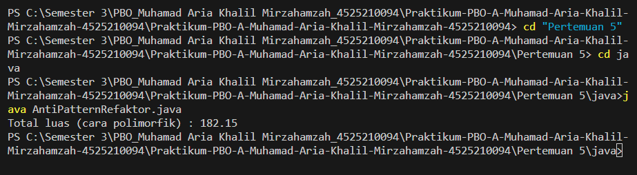

**Penjelasan:**
> `AntiPattern.java` memakai rantai `if-else if` dengan `instanceof` untuk setiap bentuk, sehingga setiap bangun baru mengharuskan method `hitungLuas()` diubah. `AntiPatternRefaktor.java` memindahkan pengetahuan cara menghitung luas ke masing-masing kelas bangun, lalu memanggil `luas()` lewat referensi `BangunDatar`. Dengan begitu, bangun baru cukup ditambahkan tanpa menyunting perulangan. Jawaban pertanyaan pemandu ditulis di `penelusuran.md`.

**Kode Lengkap:**
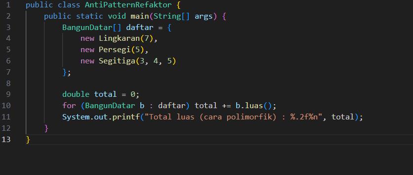
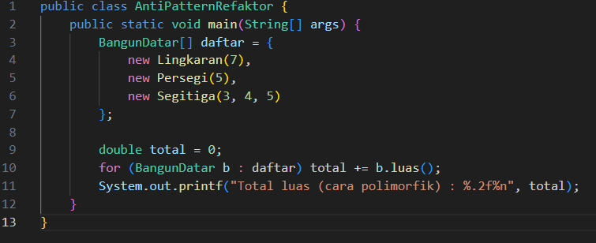

### 1.7. File: `Main.java`

* Logika perulangan tidak diubah. Hanya baris pada array `daftar` yang ditambah pada Langkah 1 sampai 4.

**Kode Program:**
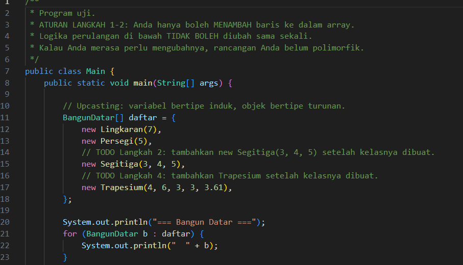
.png)

**Output Program:**
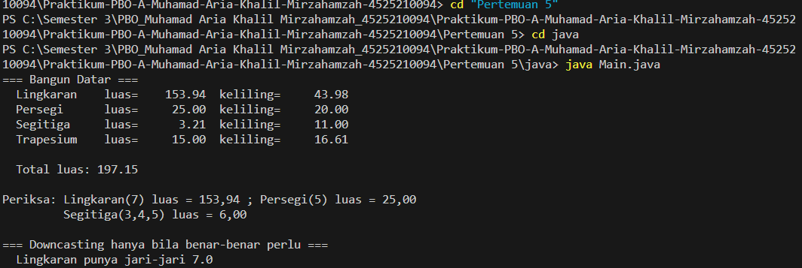

**Penjelasan:**
> `Main.java` menyimpan semua bangun dalam satu array bertipe `BangunDatar`, yang merupakan contoh upcasting. Perulangan memanggil `luas()` dan `toString()` pada setiap elemen, sehingga setiap bangun menjalankan versinya sendiri. Downcasting dengan `instanceof` hanya dipakai untuk mengambil jari-jari dari `Lingkaran`. Hasil yang diharapkan:

| Bangun | Luas | Keliling |
| :--- | :--- | :--- |
| Lingkaran(7) | 153,94 | 43,98 |
| Persegi(5) | 25,00 | 20,00 |
| Segitiga(3,4,5) | 6,00 | 12,00 |
| Trapesium(4,6,3,3,3.61) | 15,00 | 16,61 |
| **Total luas** | **199,94** | |

---

## 2. Implementasi PHP

Seluruh kelas bangun PHP berada dalam satu berkas `BangunDatar.php`, sehingga kode dan TODO-nya ada di satu tempat.

### 2.1. File: `BangunDatar.php`

**TODO 1: Validasi Jari-Jari dan Sisi**

* **Before** *(Kondisi awal / Galat logika)*:
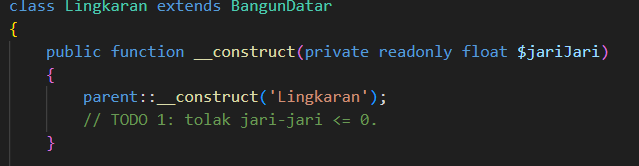

* **After** *(Kondisi akhir / Eksekusi berhasil)*:
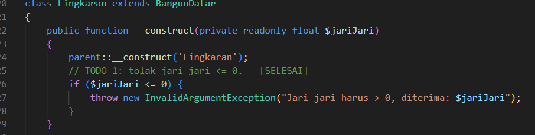

**Penjelasan:**
> Constructor `Lingkaran` dan `Persegi` melempar `InvalidArgumentException` jika nilainya tidak positif. `parent::__construct()` dipanggil lebih dulu agar nama bangun sudah terisi.

**TODO 2: Luas dan Keliling Lingkaran dan Persegi**

* **Before** *(Kondisi awal / Galat logika)*:
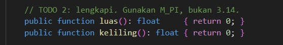

* **After** *(Kondisi akhir / Eksekusi berhasil)*:
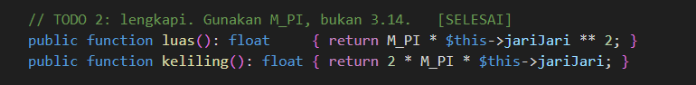

**Penjelasan:**
> `Lingkaran` memakai `M_PI` sebagai konstanta π, sedangkan `Persegi` menghitung luas dengan pangkat dua. Keduanya memenuhi kontrak `abstract` dari `BangunDatar`.

**TODO Langkah 2: Segitiga (rumus Heron)**

* **Before** *(Kondisi awal / Galat logika)*:
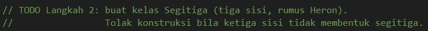

* **After** *(Kondisi akhir / Eksekusi berhasil)*:
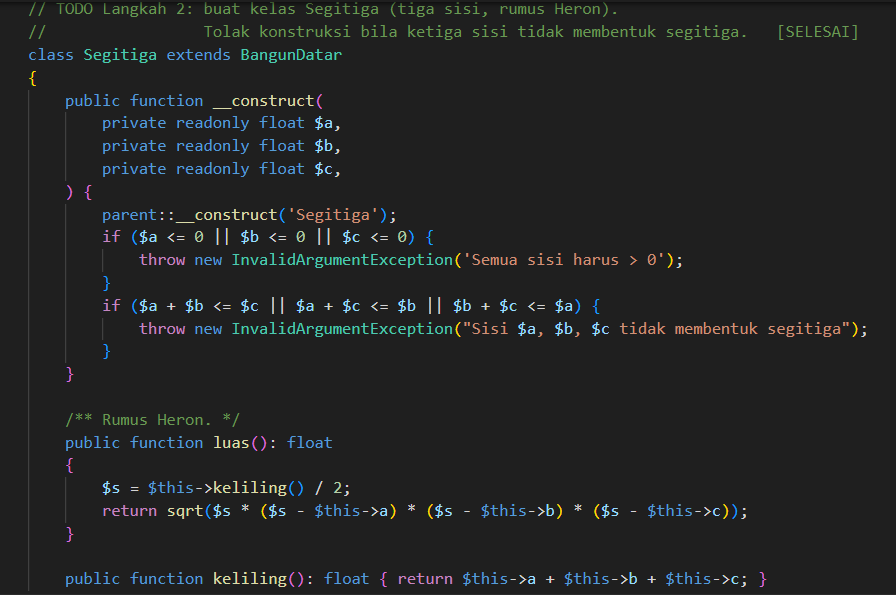

**Penjelasan:**
> Constructor menolak sisi nonpositif dan kombinasi sisi yang tidak membentuk segitiga. Keliling dijumlahkan dari ketiga sisi, lalu luas dihitung dengan rumus Heron.

**TODO Langkah 4: Trapesium**

* **After** *(Kondisi akhir / Eksekusi berhasil)*:
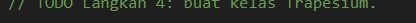

* **After** *(Kondisi akhir / Eksekusi berhasil)*:
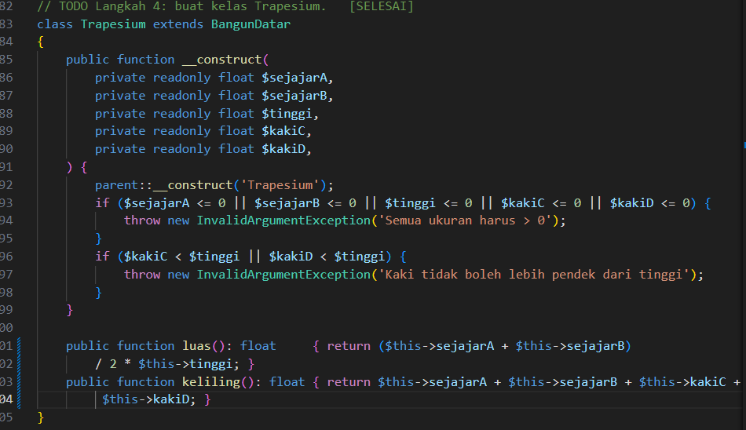

**Penjelasan:**
> `Trapesium` menerima dua sisi sejajar, tinggi, dan dua kaki. Constructor memastikan semua ukuran positif dan kaki tidak lebih pendek dari tinggi. Luas dihitung sebagai rata-rata sisi sejajar dikali tinggi.

**Kode Lengkap:**
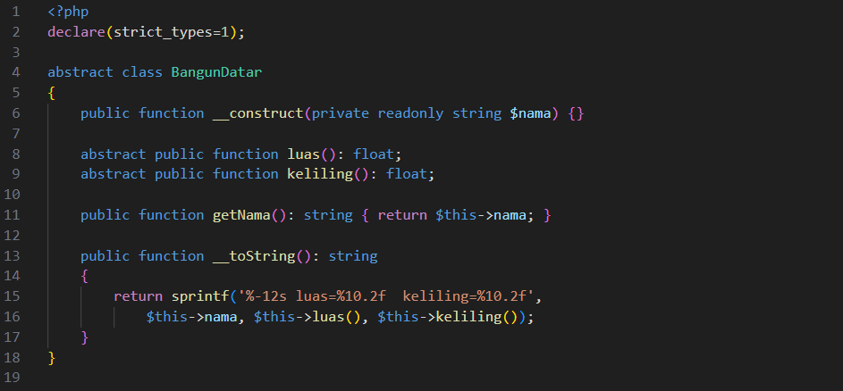
.png)
.png)
.png)
.png)
.png)

### 2.2. File: `notifikasi.php` (Langkah 6, latihan mandiri)

**TODO 1: Kelas Abstrak `Notifikasi`**

* **Before** *(Kondisi awal / Galat logika)*:
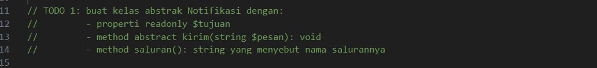

* **After** *(Kondisi akhir / Eksekusi berhasil)*:
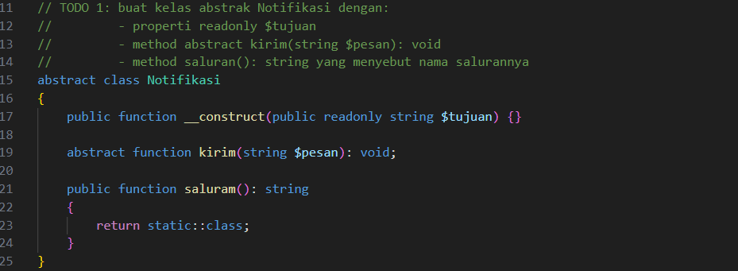

**Penjelasan:**
> `Notifikasi` menyimpan tujuan dalam properti `readonly` dan mewajibkan setiap turunan mengisi `kirim()`. Method `saluran()` mengembalikan nama kelas yang sedang berjalan melalui `static::class`.

**TODO 2: Turunan `Email`, `SMS`, dan `WhatsApp`**

* **Before** *(Kondisi awal / Galat logika)*:
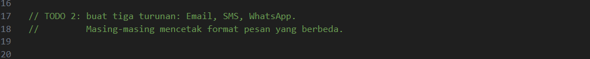

* **After** *(Kondisi akhir / Eksekusi berhasil)*:
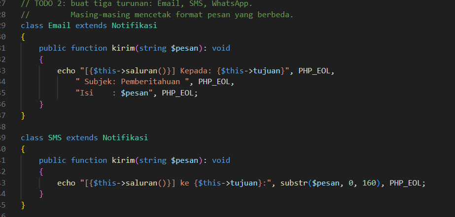
.png)

**Penjelasan:**
> Ketiga turunan memiliki format keluaran masing-masing. `SMS` memotong pesan hingga 160 karakter.

**TODO 3: Fungsi `kirimSemua()` tanpa Pemeriksaan Tipe**

* **Before** *(Kondisi awal / Galat logika)*:
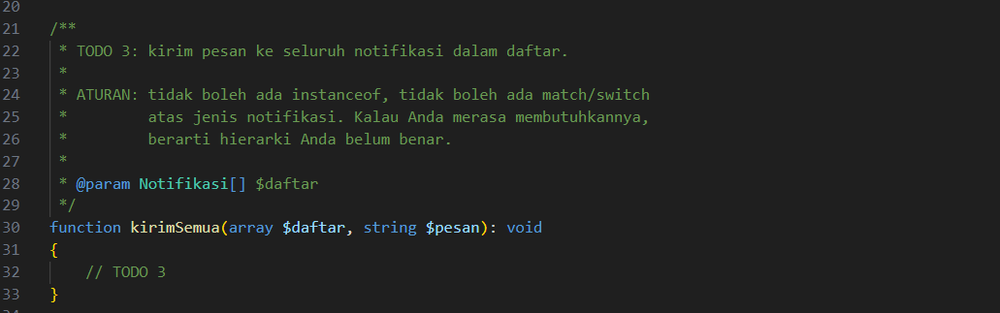

* **After** *(Kondisi akhir / Eksekusi berhasil)*:
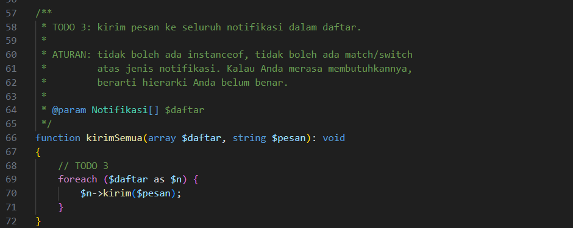

**Penjelasan:**
> Fungsi cukup memanggil `kirim()` pada setiap elemen. Tidak ada `instanceof` atau `match`, karena setiap kelas sudah tahu cara mengirim pesannya sendiri.

**Kode Lengkap:**
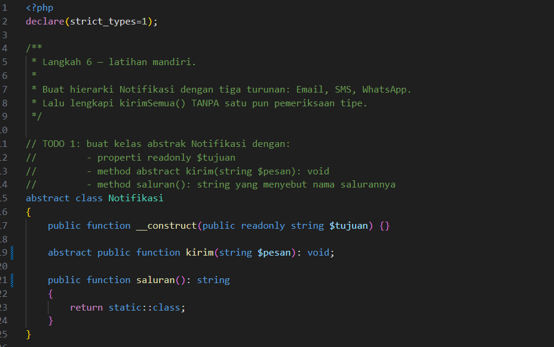
.png)
.png)

**Output Program:**
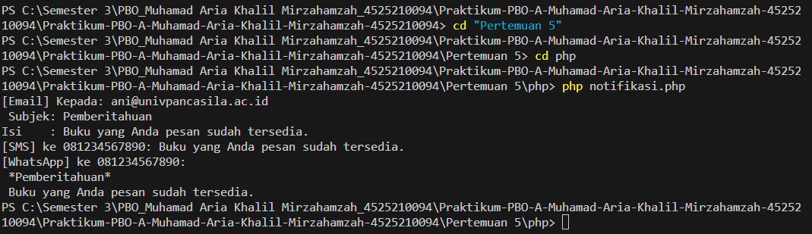

### 2.3. File: `main.php`

* Tidak ada TODO pada `main.php`. Hanya penambahan `Segitiga` dan `Trapesium` pada array.

**Kode Program:**
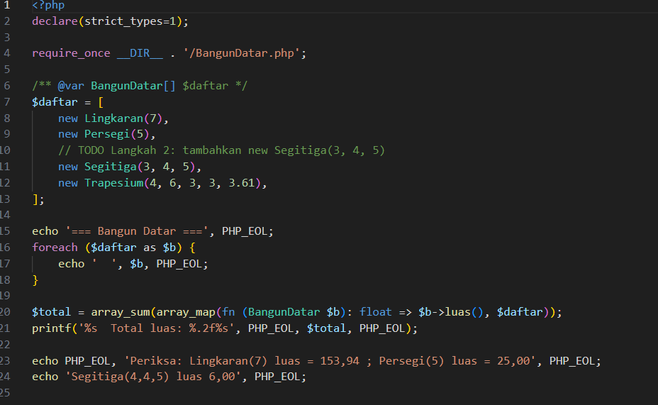

**Output Program:**
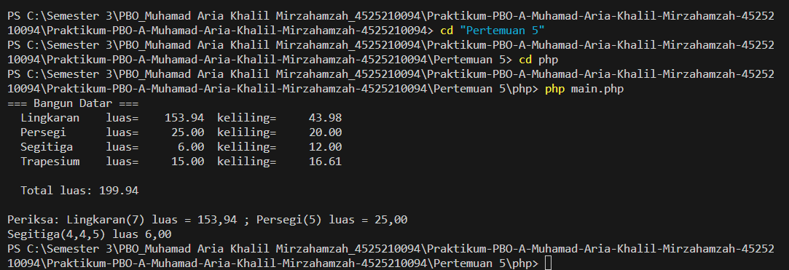

**Penjelasan:**
> `main.php` menyimpan keempat bangun dalam satu array bertipe `BangunDatar[]`, mencetak setiap bangun, lalu menjumlahkan luasnya. Hasilnya sama dengan versi Java, yaitu total luas 199,94.

---

## 3. Kesimpulan

> Pertemuan 5 membahas polimorfisme. Kelas induk `BangunDatar` menetapkan kontrak `luas()` dan `keliling()`, sedangkan setiap turunan, yaitu `Lingkaran`, `Persegi`, `Segitiga`, dan `Trapesium`, mengisi caranya sendiri. Kelas induk bersifat `abstract` sehingga objeknya tidak bisa dibuat langsung.
>
> Perulangan dalam `Main` memanggil `luas()` pada tipe induk, tetapi hasilnya ditentukan oleh tipe objek saat runtime. Inilah dynamic dispatch. Dengan pola ini, bangun baru cukup ditambahkan sebagai kelas baru tanpa mengubah kode yang sudah ada. Sebaliknya, versi anti-pattern memaksa `hitungLuas()` disunting setiap kali ada bangun baru, dan lupa menambahkan satu cabang akan menimbulkan error saat runtime.
>
> Hasil yang diharapkan adalah total luas 199,94 dan keliling Segitiga(3,4,5) sebesar 12. Pada Langkah 6, `kirimSemua()` cukup memanggil `kirim()` untuk setiap notifikasi tanpa memeriksa tipenya.
>
> Perbaikan yang disarankan meliputi penyeragaman jenis exception di seluruh kelas bangun, penambahan pengujian otomatis dengan JUnit atau PHPUnit untuk memastikan nilai luas dan keliling tetap benar setelah perubahan, serta pemberian nama file dan kelas yang konsisten, misalnya `AntiPatternRefaktor.java`.