# LAPORAN PRAKTIKUM PEMROGRAMAN BERBASIS OBJEK

| Informasi Praktikan | Keterangan |
| :--- | :--- |
| **Nama** | Muhamad Aria Khalil Mirzahamzah |
| **NPM** | 4525210094 |
| **Kelas** | A |
| **Mata Kuliah** | Pemrograman Berbasis Objek (PBO) |
| **Pertemuan** | 6 - Antarmuka (Interface), Enum, dan Trait |
| **Tanggal** | [ 08/10/2026 ] |

---

## 1. Implementasi Java

### 1.1. File: `Kendaraan.java`

**TODO 1: Umur Kendaraan**

* **Before** *(Kondisi awal / Galat logika)*:
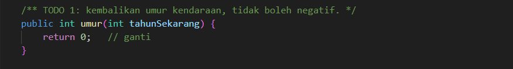

* **After** *(Kondisi akhir / Eksekusi berhasil)*:
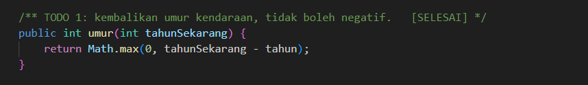

**Penjelasan:**
> Method `umur()` menghitung selisih tahun sekarang dengan tahun pembuatan. Hasilnya dibatasi dengan `Math.max(0, ...)` sehingga tidak pernah negatif, misalnya jika tahun yang dimasukkan lebih kecil dari tahun pembuatan.

### 1.2. File: `Movable.java`

**TODO 1: Default Method `ringkasanGerak()`**

* **Before** *(Kondisi awal / Galat logika)*:
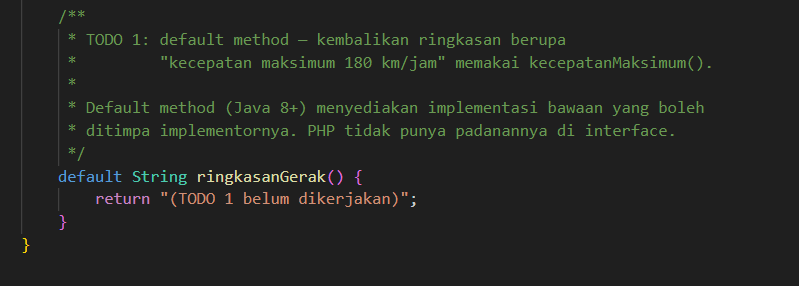

* **After** *(Kondisi akhir / Eksekusi berhasil)*:
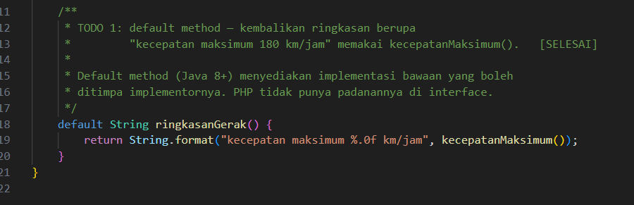

**Penjelasan:**
> `ringkasanGerak()` adalah default method yang sudah memiliki implementasi di dalam interface. Method ini memanggil `kecepatanMaksimum()` dan mengembalikan teks kecepatan dalam km/jam. Implementor boleh menimpanya, tetapi tidak wajib.

### 1.3. File: `Mobil.java`

**TODO 1: Kontrak `Movable` (`bergerak()` dan `kecepatanMaksimum()`)**

* **Before** *(Kondisi awal / Galat logika)*:
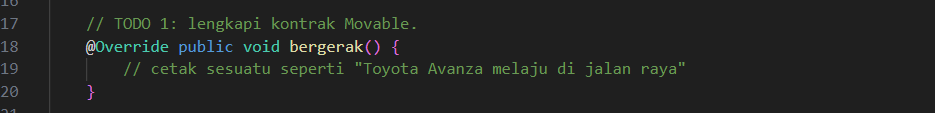

* **After** *(Kondisi akhir / Eksekusi berhasil)*:
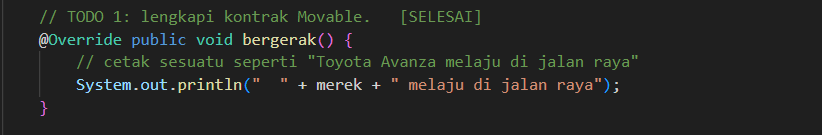

**Penjelasan:**
> `bergerak()` mencetak nama merek kendaraan yang sedang melaju, dan `kecepatanMaksimum()` mengembalikan 180 km/jam. Kedua method ini wajib ada karena `Mobil` mengimplementasikan `Movable`.

**TODO 2: Kontrak `Fuelable` (`isiBahanBakar()`)**

* **Before** *(Kondisi awal / Galat logika)*:
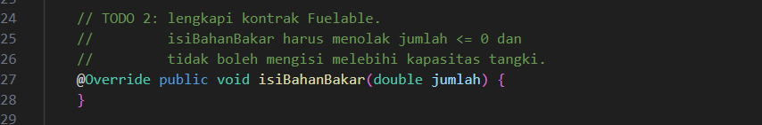

* **After** *(Kondisi akhir / Eksekusi berhasil)*:
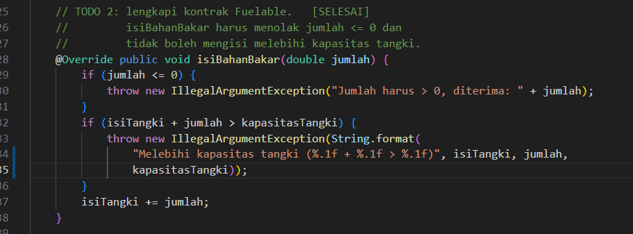

**Penjelasan:**
> `isiBahanBakar()` menolak jumlah yang tidak positif dan menolak pengisian yang membuat isi tangki melebihi kapasitas. Kedua pemeriksaan dilakukan sebelum isi tangki diubah, sehingga tangki tidak pernah berada dalam kondisi yang tidak valid.

**Kode Lengkap:**
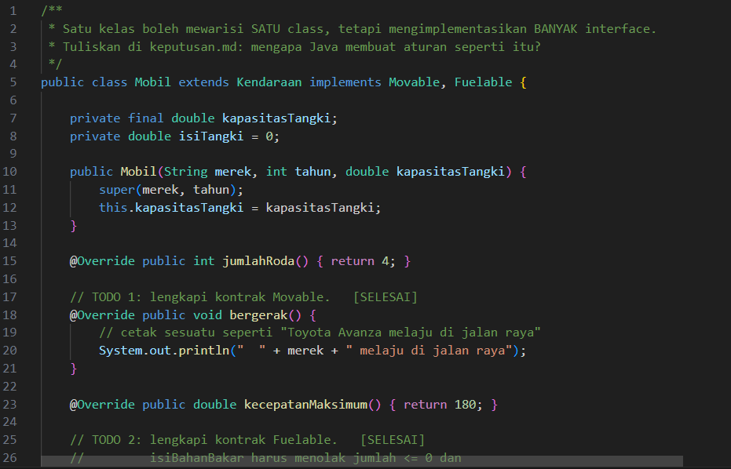
.png)

### 1.4. File: `TipeBahanBakar.java`

**TODO 1: Konstanta Enum**

* **Before** *(Kondisi awal / Galat logika)*:
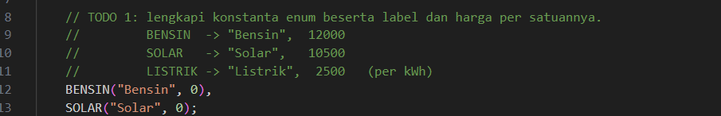

* **After** *(Kondisi akhir / Eksekusi berhasil)*:
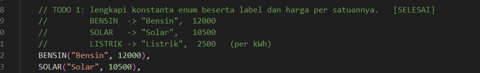

**Penjelasan:**
> Setiap konstanta enum membawa label dan harga per satuan. Konstanta `LISTRIK` ditambahkan dengan harga Rp2.500 per kWh. Enum hanya menerima nilai yang terdaftar, sehingga angka sembarang seperti 99 tidak bisa masuk.

**TODO 3: Method `biayaPengisian()`**

* **Before** *(Kondisi awal / Galat logika)*:

* **After** *(Kondisi akhir / Eksekusi berhasil)*:

**Penjelasan:**
> Enum dapat memiliki method, sesuatu yang tidak bisa dilakukan oleh konstanta `int`. Method ini mengalikan harga per satuan dengan jumlah yang diisi.

**TODO 4: Method `ramahLingkungan()`**

* **Before** *(Kondisi awal / Galat logika)*:
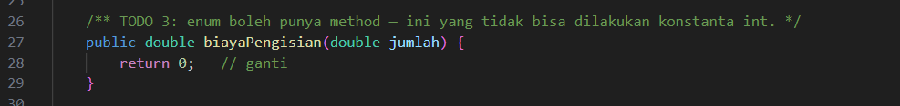

* **After** *(Kondisi akhir / Eksekusi berhasil)*:
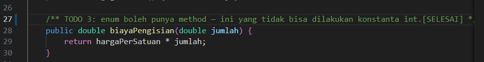

**Penjelasan:**
> Method ini hanya bernilai `true` untuk `LISTRIK`. Pembandingan memakai `this == LISTRIK`, karena setiap konstanta enum adalah satu-satunya objek di JVM.

**Kode Lengkap:**
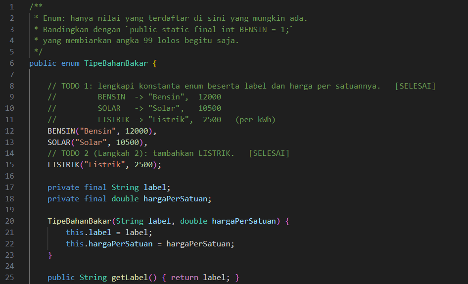
.png)

### 1.5. File: `Fuelable.java`

* Tidak ada TODO pada `Fuelable.java`.

**Kode Lengkap:**
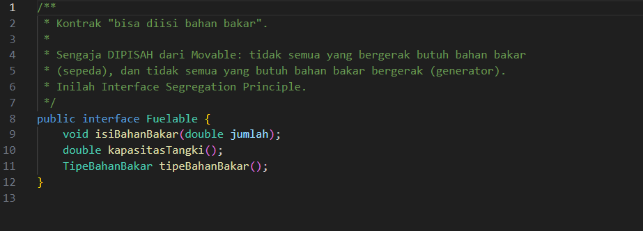

**Penjelasan:**
> `Fuelable` dipisahkan dari `Movable` karena tidak semua kendaraan membutuhkan bahan bakar, misalnya sepeda. Pemisahan ini sejalan dengan Interface Segregation Principle.

### 1.6. Langkah 4: File `Sepeda.java`

Kelas `Sepeda` mewarisi `Kendaraan` dan mengimplementasikan `Movable`, tetapi tidak mengimplementasikan `Fuelable`.

**Penolakan saat kompilasi:**
* **Before** *(Pemanggilan `isiPenuh(sepeda)` diaktifkan)*:
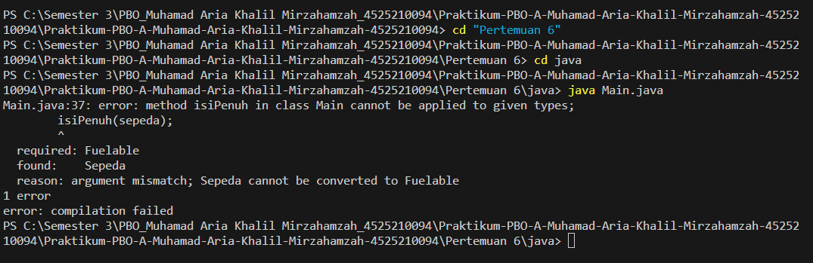

**Kode Lengkap:**
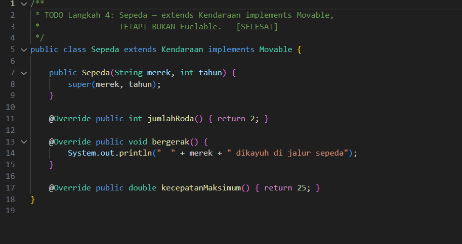

**Penjelasan:**
> Ketika baris `isiPenuh(sepeda);` diaktifkan, kompilator menolak kode dengan pesan `incompatible types: Sepeda cannot be converted to Fuelable`. Penolakan ini terjadi sebelum program dijalankan, sehingga kesalahan tidak bisa lolos ke tahap eksekusi. Ini menguntungkan karena kesalahan logika langsung terlihat saat pengembangan.

### 1.7. File: `Main.java`

* Tidak ada TODO yang harus diisi. Baris `Sepeda` ditambahkan ke daftar `Movable`, dan baris `isiPenuh(sepeda)` tetap dikomentari agar program bisa dijalankan.

**Kode Program:**
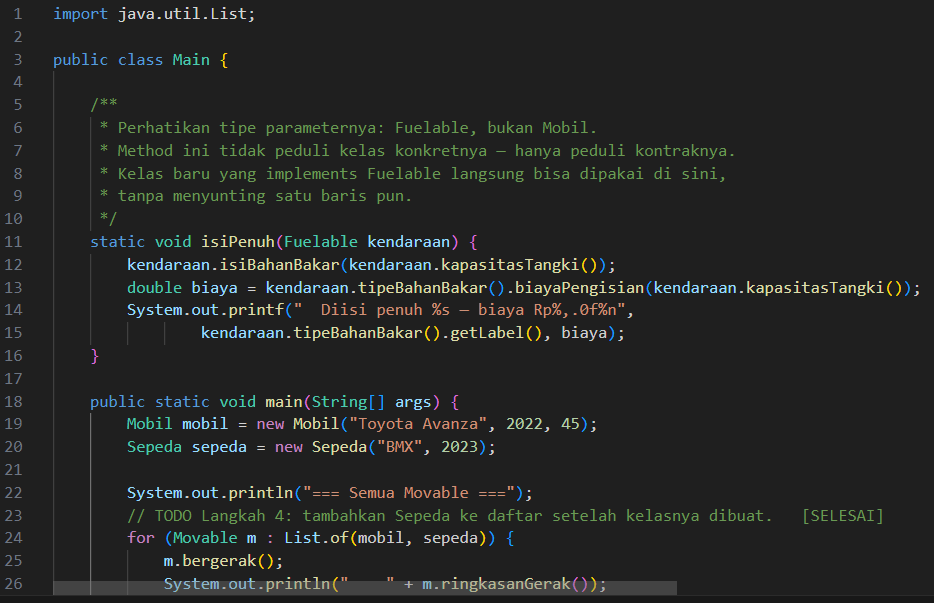
.png)

**Output Program:**

**Penjelasan:**
> `Main.java` memanggil `bergerak()` dan `ringkasanGerak()` lewat referensi `Movable`, lalu memanggil `isiPenuh()` yang hanya menerima `Fuelable`. Bagian enum menampilkan label, status ramah lingkungan, dan biaya pengisian 10 satuan untuk setiap tipe. Hasil yang diharapkan:

| Tipe | Ramah lingkungan | Biaya 10 satuan |
| :--- | :--- | :--- |
| Bensin | false | Rp120.000 |
| Solar | false | Rp105.000 |
| Listrik | true | Rp25.000 |

Pengisian penuh Toyota Avanza (45 liter Bensin) menghasilkan biaya Rp540.000.

---

## 2. Implementasi PHP

Seluruh kode PHP pertemuan ini berada dalam satu berkas `abstraksi.php`, sehingga kode dan TODO-nya ada di satu tempat.

### 2.1. File: `abstraksi.php`

**TODO 1: Case `Listrik` pada Enum**

* **Before** *(Kondisi awal / Galat logika)*:

* **After** *(Kondisi akhir / Eksekusi berhasil)*:

**Penjelasan:**
> Enum PHP bertipe `string` sehingga setiap case memiliki nilai. Case `Listrik = 'listrik'` ditambahkan agar sejalan dengan versi Java.

**TODO 2: Method `label()`**

* **Before** *(Kondisi awal / Galat logika)*:
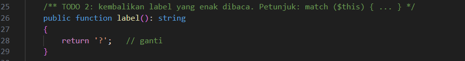

* **After** *(Kondisi akhir / Eksekusi berhasil)*:
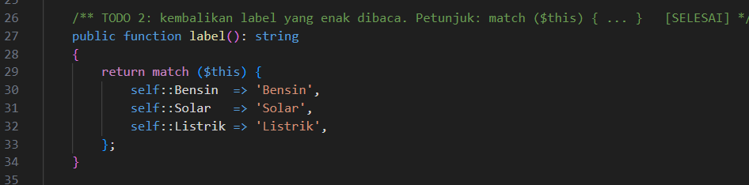

**Penjelasan:**
> Method ini memakai `match ($this)` untuk mengembalikan label yang mudah dibaca. `match` memeriksa semua case, sehingga jika ada case yang terlewat, PHP akan melempar error.

**TODO 3: Method `hargaPerSatuan()`**

* **Before** *(Kondisi awal / Galat logika)*:
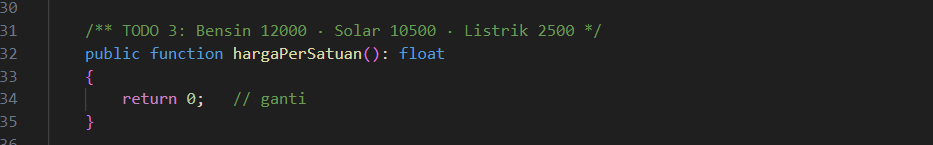

* **After** *(Kondisi akhir / Eksekusi berhasil)*:
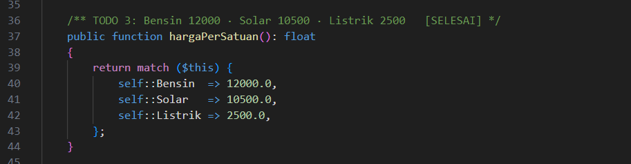

**Penjelasan:**
> Harga per satuan dikembalikan melalui `match` dengan nilai Bensin 12.000, Solar 10.500, dan Listrik 2.500.

**TODO 4: Method `biayaPengisian()`**

* **Before** *(Kondisi awal / Galat logika)*:
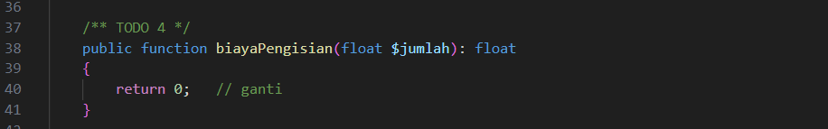

* **After** *(Kondisi akhir / Eksekusi berhasil)*:
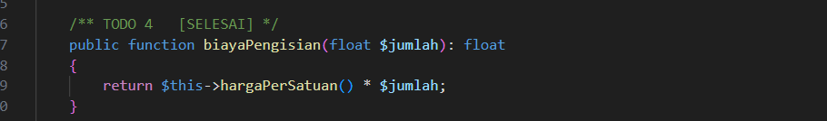

**Penjelasan:**
> Method ini memanggil `hargaPerSatuan()` lalu mengalikannya dengan jumlah, sama seperti versi Java.

**TODO 5: Method `ramahLingkungan()`**

* **Before** *(Kondisi awal / Galat logika)*:
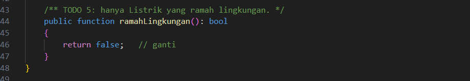

* **After** *(Kondisi akhir / Eksekusi berhasil)*:
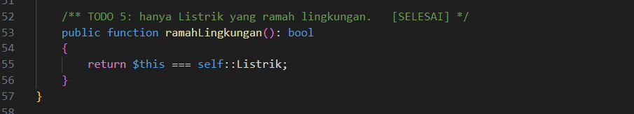

**Penjelasan:**
> Method ini mengembalikan `true` hanya jika `$this === self::Listrik`.

**TODO 6: Trait `Loggable`**

* **Before** *(Kondisi awal / Galat logika)*:
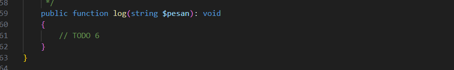

* **After** *(Kondisi akhir / Eksekusi berhasil)*:
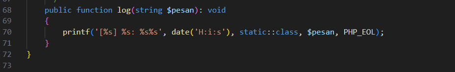

**Penjelasan:**
> Trait adalah cara PHP menggunakan ulang kode tanpa pewarisan. Method `log()` mencetak waktu, `static::class` (nama kelas yang memakai trait), dan pesan. `static::class` dipakai agar nama kelas yang tampil adalah kelas pemakainya, bukan nama trait.

**TODO 7: Method `umur()`**

* **Before** *(Kondisi awal / Galat logika)*:
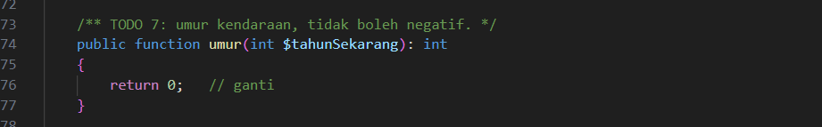

* **After** *(Kondisi akhir / Eksekusi berhasil)*:
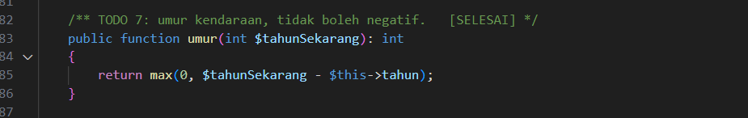

**Penjelasan:**
> Logikanya sama dengan versi Java, yaitu `max(0, $tahunSekarang - $this->tahun)`.

**TODO 8: Kontrak `Movable` dan `Fuelable` pada `Mobil`**

* **Before** *(Kondisi awal / Galat logika)*:
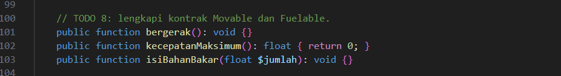

* **After** *(Kondisi akhir / Eksekusi berhasil)*:
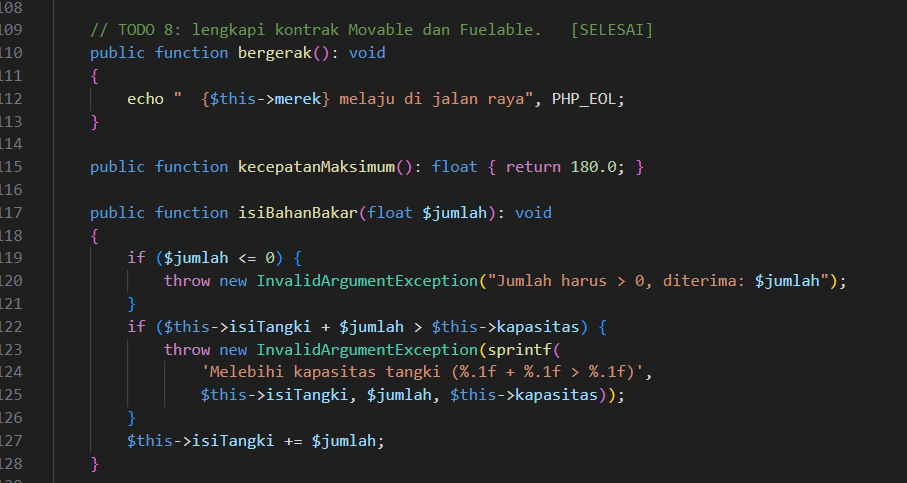

**Penjelasan:**
> `bergerak()`, `kecepatanMaksimum()`, dan `isiBahanBakar()` diisi dengan logika yang sama seperti versi Java. `isiBahanBakar()` melempar `InvalidArgumentException` untuk jumlah tidak positif atau melebihi kapasitas.

**Langkah 4: Kelas `Sepeda`**

* **Before** *(Sepeda dipanggil dengan `isiPenuh()`)*:
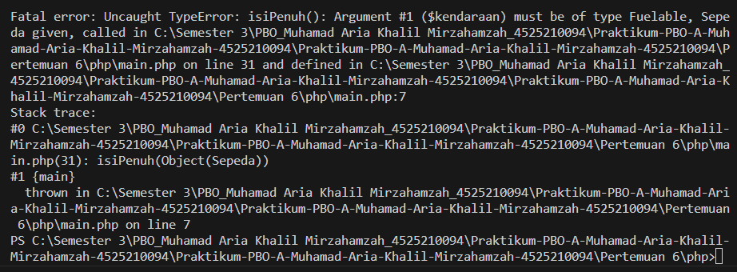

**Penjelasan:**
> Ketika `isiPenuh($sepeda)` diaktifkan, PHP melempar `TypeError` dengan pesan `isiPenuh(): Argument #1 ($kendaraan) must be of type Fuelable, Sepeda given`. Berbeda dengan Java, kesalahan ini baru terdeteksi saat program dijalankan, bukan saat kompilasi.

**Langkah 5: Kelas `Pesanan`**

* Kelas `Pesanan` hanya memakai trait `Loggable` dan tidak memiliki hubungan dengan `Kendaraan`.

**Kode Lengkap:**
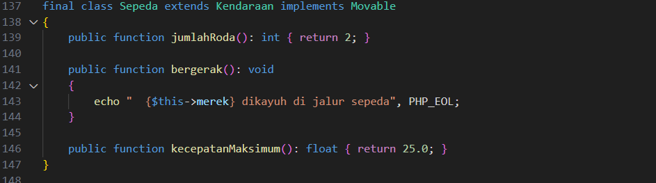
.png)

### 2.2. File: `main.php`

* Tidak ada TODO yang harus diisi. Baris `isiPenuh($sepeda)` tetap dikomentari.

**Kode Program:**
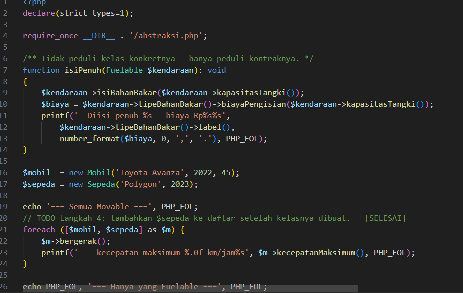
.png)

**Output Program:**
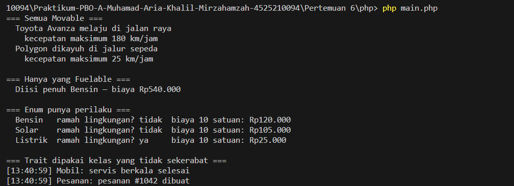

**Penjelasan:**
> `main.php` memanggil `bergerak()` dan `kecepatanMaksimum()` pada setiap kendaraan, mengisi bahan bakar lewat fungsi `isiPenuh()` yang menerima `Fuelable`, dan mencetak tabel enum. Bagian akhir memanggil `log()` dari trait pada `Mobil` dan `Pesanan`.

---

## 3. Kesimpulan

> Pertemuan 6 membahas interface, enum, dan trait. Interface `Movable` dan `Fuelable` memisahkan kemampuan bergerak dari kemampuan diisi bahan bakar, sehingga `Sepeda` cukup bergerak tanpa dipaksa memiliki tangki. Method yang menerima `Fuelable` hanya peduli pada kontraknya, sehingga kelas baru yang mengimplementasikannya dapat langsung dipakai tanpa perubahan pada method tersebut.
>
> Enum membatasi nilai yang mungkin, sekaligus dapat memiliki perilaku seperti `biayaPengisian()` dan `ramahLingkungan()`. Trait memungkinkan `Mobil` dan `Pesanan` berbagi method `log()` di PHP, meskipun kedua kelas tidak memiliki hubungan pewarisan.
>
> Perbedaan utama Java dan PHP terlihat pada saat kesalahan terdeteksi. Java menolak `isiPenuh(sepeda)` saat kompilasi, sedangkan PHP baru melempar `TypeError` saat dijalankan. Catatan untuk `keputusan.md` berisi pesan kesalahan kedua bahasa beserta penjelasan mengapa penolakan saat kompilasi lebih menguntungkan.
>
> Perbaikan yang disarankan meliputi penghapusan komentar `// TODO` yang sudah selesai, pembuatan berkas `keputusan.md` dan `penelusuran.md` sesuai instruksi, serta penambahan pengujian otomatis dengan JUnit atau PHPUnit untuk memastikan validasi dan perhitungan biaya tetap benar.